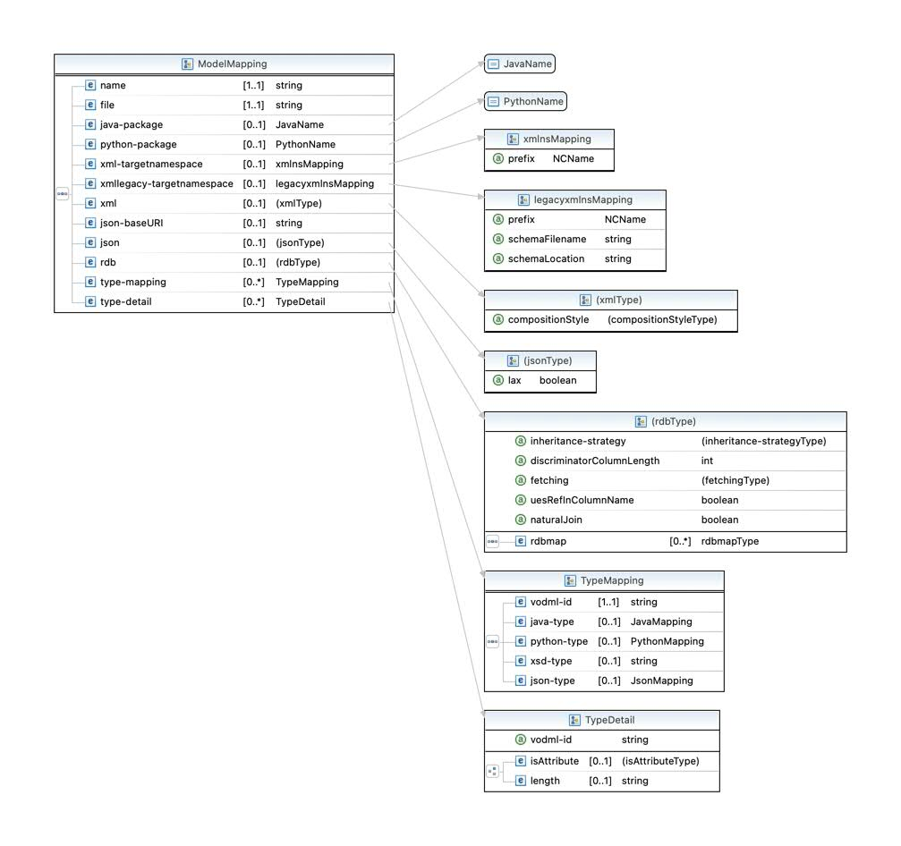

Binding
=======

When generating various products from the VO-DML there is often a choice to be made in translating the VO-DML into a concrete representation - the definition of these choices is called binding.

The mechanism for specifying the binding is via an XML file that conforms to the [binding schema](https://github.com/ivoa/vo-dml/blob/b72031d944afd2d7d66613552ab8df2146eb2243/xsd/vo-dml-binding.xsd). A visual representation of the main part of the schema is shown below


The binding file can contain bindings for multiple VODML models, so the overall structure is

```XML 
<m:mappedModels xmlns:m="http://www.ivoa.net/xml/vodml-binding/v0.9.1">
    <model>
        <name>a</name>
        <file>a.vo-dml.xml</file>
        
    </model>
    <model>
        <name>b</name>
        <file>b.vo-dml.xml</file>
        ...
    </model>
        ...
</m:mappedModels>

```
where each ```<model>``` element corresponds to the ```ModelBinding``` type in the diagram above.

## Basic code generation parameters

* ```<java-package>``` specifies the base Java package for generated code (packages in the VO-DML will create further sub-packages under this).
* ```<python-package>``` specifies the base Python package.
* ```<xml-targetnamespace prefix="...">``` specify the XML namespace and prefix for the xml serialization of the model instances.
* ```<json-baseURI>``` allow the base URI for the JSON schema to be modified.

## Type mapping

It is possible (and indeed necessary for primitiveTypes) to map a VO-DML type to a specific type in the various languages/serializations that the VO-DML tooling can generate.

An example of the binding is given below for the primitiveType ```ivoa:real``` 

```XML
<type-mapping>
  <vodml-id>real</vodml-id>
  <java-type jpa-atomic="true">Double</java-type>
  <python-type built-in="true">float</python-type>
  <xsd-type>xsd:float</xsd-type>
  <json-type built-in="true">number</json-type>
</type-mapping>
```

It is possible to map DataTypes too, although they will most likely need to be mapped to a hand written type in the target language.

The [binding file for the base IVOA model](https://github.com/ivoa/vo-dml/tree/master/models/ivoa/vo-dml/ivoa_base.vodml-binding.xml)
shows extensive use of the type mapping features, where it is possible to ignore the automated code generation entirely and substitute
hand-written code.

## Stylistic options

### XML serialization

#### isAttribute
when serializing to XML, whether the VO-DML attribute is serialized as an XML attribute - the default is to serialize as XML elements.

#### compositionStyle
in the XML serialization this determines  whether compositions with multiplicities greater than 1 should have a wrapper element - the choices are

* wrapped
* unwrapped

and the default is wrapped.
### JSON serialization
#### lax

whether definitions in the schema model should be "closed off" with "additionalProperties": false - if a type definition is expected to be extended, then this cannot be done.

The default is false which indicates that types should be "closed off".

In general if a model is expected to be used a a "base model" then this should probably be set to true for the model.

## RDB mapping for TAP schema
There are various stylistic choices that can be made about how to map a VO-DML model to a relational database. The binding makes these choices concreate for a particular model.
### Inheritance Strategy

This can either be 
* joined
* single-table

If joined then each sub-type creates a separate table to store its unique attributes. In contrast the single-table strategy has a single table with columns for all of the attributes in the whole class hierarchy. In this second case there needs to be a discriminator column which can have its size specified with ```discriminatorColumnLength```
### NaturalJoin
If true then primary keys will have a name that includes the table name so that natural joins might be made -
otherwise the default is that surrogate primary keys as just called ID. 
### uesRefInColumnName
if true the column name for a reference will use the referred name in some way (depenedent on naturalJoin)
rather than simply using the member name as the column name

### Mapping individual types
It is possible to alter the mapping of individualTypes

* tableName - the name of the table can be explicitly changed from the default of being the same as the VO-DML name.
* noTableWhenInComposition - when true, if the type is involved in a composition where maxOccurs = 1 a separate table is not created, but instead it is treated similarly to a DataType - the default is false.


