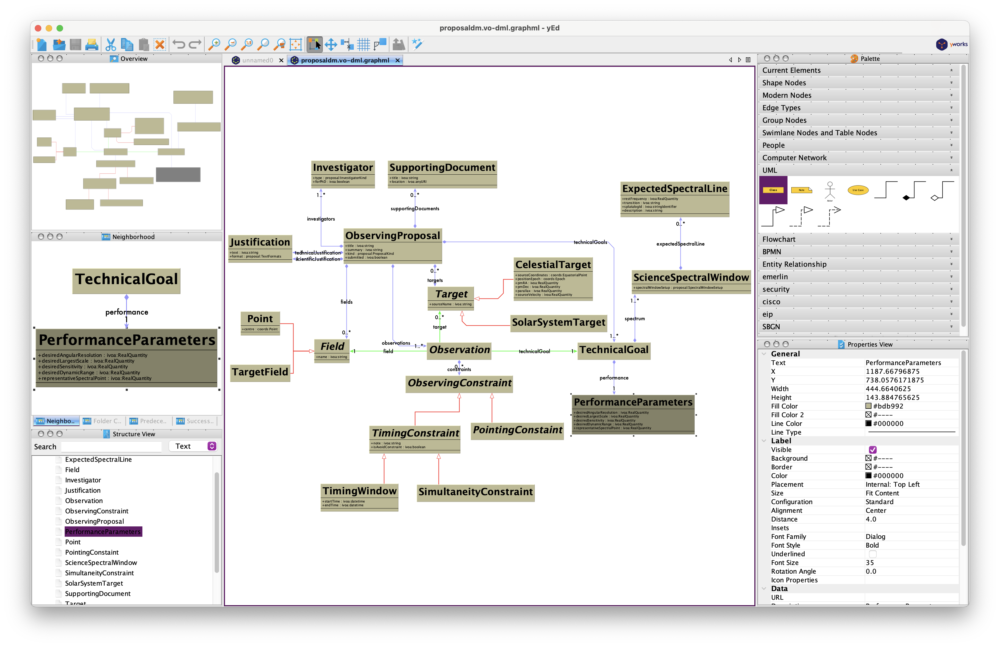
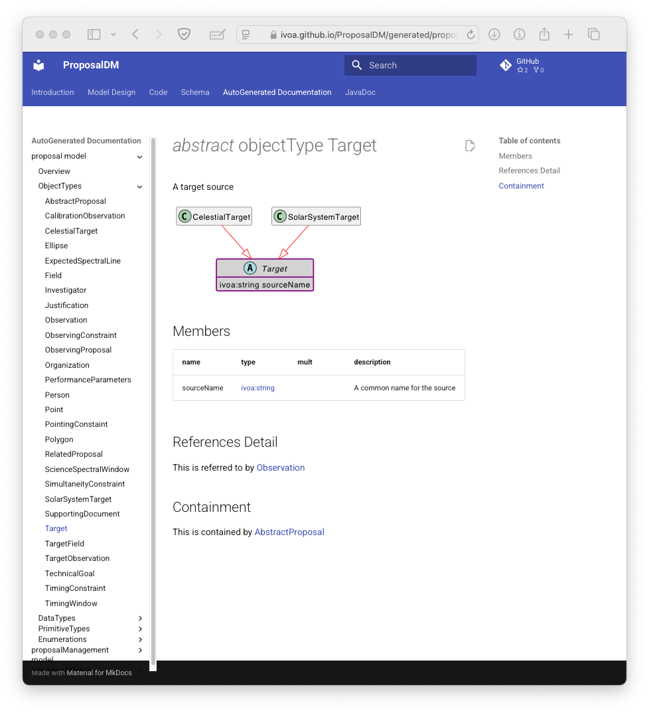

Documentation
=============

## Individual files

```shell
gradle vodmlDoc 
```

will generate standard documentation into the directory `build/generated/docs/vodml/` (this can be changed with the `outputDocDir` setting)

This will produce a model diagram, latex and html formatted documentation, as well as a graphml  representation of the model (a file with a `.graphml` extension)
that can be hand edited with [yEd](https://www.yworks.com/products/yed) for nicer looking model diagrams.



## Static Site

```shell
gradle vodmlSite
```

Will generate a whole static site describing the model that is intended to be
further processed with the [mkdocs](https://www.mkdocs.org) tool that is configured with the [material theme](https://squidfunk.github.io/mkdocs-material/).

The site is generated at in the `build/generated/docs/vodml-site/` directory (which can be 
changed with the `outputSiteDir` setting). If you are creating full documentation site, 
then it is likely that you will want to add content other than the autogenerated model 
description. In this case the tools have an assumption that the `outputSiteDir` is set to a
`generated` sub-directory of your configured mkdocs top-level directory.

The plugin will create an `allnav.yaml` file in the project directory which can be added to the mkdocs navigation using `yq` by adding the following to the `build.gradle.kts`

```kotlin
tasks.register<Exec>("siteNav")
{
    commandLine("yq", "-i",  "(.nav.[]|select(has(\"AutoGenerated Documentation\"))|.[\"AutoGenerated Documentation\"]) += load(\"allnav.yml\")", "mkdocs.yml")
    dependsOn("vodmlSite")
}

```

which in turn assumes that there is an "AutoGenerated Documentation" section in the mkdocs nav that can be added to.

```yaml
nav:
  - Home: index.md
  - AutoGenerated Documentation:
      - Javadoc: generated/javadoc
```

### ER Diagram

In addition to the other diagrams the site documentation command will generate a plantuml definition of the entity relationship diagram for the TAP schema for the model. To include the diagram in the site documentation the following can be used on a 
page.

`````
 ``` plantuml format="svg_inline" source="./generated/schema/TemplateDM-v1.vo-dml.tap.plantuml"
 ```
`````

### Example Site

The [DataModel Template](https://github.com/ivoa/DataModelTemplate/) has an example setup, and the [ProposalDM](https://ivoa.github.io/ProposalDM/) has a mature example with many objects.



