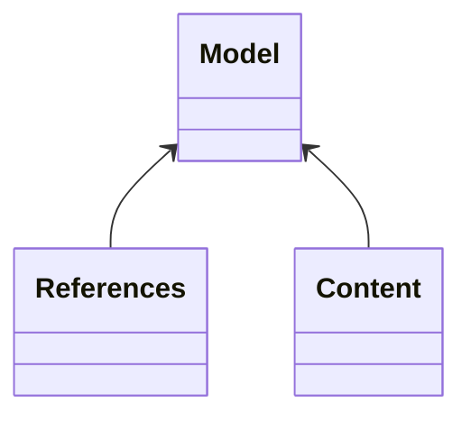

Serialization
=============

The design choices made in the serialization of the models to various formats has been driven by the capabilities
of the various libraries/standards that are applicable to the Java generated code. Other language implementations
will follow the choices that were made in order to be interoperable.

For the serializations (other than the relational database), the general idea is that a "natural" serialization for the model
has been chosen, in contrast to the approach of [MIVOT](https://www.ivoa.net/documents/MIVOT/)
where the idea is that the model is coerced into a table based model - which of course is similar to the relational 
database serialization below. This "natural" serialization means that objects are enclosed within their parents to whatever depth 
is necessary. The only exception to this is that referenced objects that are not otherwise contained within another object in the model are separated out into their own section early in the 
serialization so that they can easily be referenced.



The aim of the top level container object is to contain all the referred to objects as well as the general content within
a single document. It should be noted that this is a different methodology to the way that the 
XML was produced in the previous (ant based) versions of this tooling, and as such the XML target namespaces have been changed.


## XML

For the [small example model](https://github.com/ivoa/vo-dml/tree/master/models/sample/test/serializationExample.vodsl), the overall model object will produce xml like

```xml
<ser:myModelModel xmlns:ser="http://ivoa.net/vodml/sample/serialization" >
    <refs>
        <refa id="id_0">
            <val>a value</val>
        </refa>
        <refb>
            <name>a name</name>
            <val>another val</val>
        </refb>
    </refs>
    <SomeContent>
        <zval>a z val</zval>
        <ref1>id_0</ref1>
        <ref2>a name</ref2>
    </SomeContent>
</ser:myModelModel>
```

## JSON

JSON does not natively have an equivalent to the XML-ID/IDREF mechanism, however, it is possible to distinguish between 
a named object as the value of a field or a string or integer literal value for the same field which could be interpreted
as a reference to the object if the data model is known.

```json
{
  "MyModelModel" : {
    "refs" : {
      "MyModel:Refa" : [ {
        "_id" : 0,
        "val" : "a value"
      } ],
      "MyModel:Refb" : [ {
        "name" : "a name",
        "val" : "another val"
      } ]
    },
    "content" : [ {
      "@type" : "MyModel:SomeContent",
      "zval" : "a z val",
      "ref1" : 0,
      "ref2" : "a name"
    } ]
  }
}
```
In general where the type of an object cannot be inferred unambiguously from the model,  a member called `@type` with the UType as value is added.

## Relational Databases
The object relational mapping has been done with the capabilities offered by JPA. The general design 
decisions that have been made for the mapping are.

* The default [inheritance strategy](https://en.wikibooks.org/wiki/Java_Persistence/Inheritance) is "JOINED" - which means that there will be a table per sub-type that has to be joined. This strategy the default as it allows for the widest application of "NOT NULL" constraints within the database, at the expense of more complex joins being required. As an alternative a "SINGLE_TABLE" strategy can be adopted, by specifying 
```xml
        <rdb inheritance-strategy="single-table"/>
```
in the binding file for the model.

* DataTypes become embedded as extra columns within the table.

Generating the actual DDL for the database does necessarily depend on some differences between vendors.
However, running the test will produce DDL.