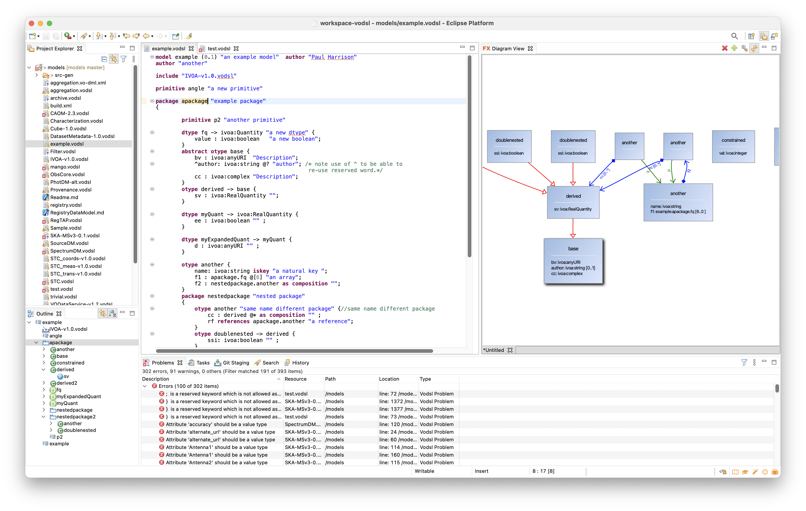

# Eclipse VODSL Editor 

Although it is possible to edit VODSL with any plain text editor as
discussed in [the introduction](../index.md), an Eclipse plug-in has been
created, that allows VOSDL source to be edited whilst taking
advantage of the all the features of the Eclipse that make understanding
an navigating the code easier. As well as the expected IDE conveniences
of syntax colouring, context sensitive suggestions and ease of
navigation, the most important feature of the plug-in are;

- Compilation of VODSL to VO-DML.

- Real-time validation and syntax checking.

- Navigation via a graphical representation of the model.

### VODSL compilation

The plugin will compile any VODSL it finds (files with ‘.vodsl‘
extension) to the output directory specified in the compiler section of
the VODSL preferences. The compilation will occur whenever the enclosing
project is built, and if “build automatically” is set then this will be
every time that the VODSL file is saved.

### The Graphical View

The graphical view of the model is implemented in
[FXDiagram](http://jankoehnlein.github.io/FXDiagram/) and uses some of
the same conventions as the standard graphical representation produced
by the VO-DML tools, i.e. 

- subclass relations are represented by red connectors

- reference relations are represented by green connectors

- composition relations are represented by blue connectors

The graphical view is opened by right clicking on one of the
declarations in the text view of the model and selecting “Show in
FXDiagram $\Rightarrow$ VODSL model”

The graphical representation of the model is basically read-only in that
it is not possible to edit model features in the graphical window.
However, as well as visualisation, it can usefully be used for
navigation around the model.

Navigation in the view is possibly a little un-intuitive - on a Mac the
following gestures work

- Panning is done with a two finger drag on trackpad.

- Zooming is done with a two finger pinch gesture.

- A menu consisting of a ring of icons can be invoked with a two finger
  tap - the menu as a range of functions including changing the zoom and
  saving the diagram.

- Double-clicking on a model item in the view will select that item in
  the textual view, and conversely, right-clicking in the textual view
  and chosing "Show in FXDiagram" again will select the item in the
  graphical view.

### Installing the Eclipse plugin

It is generally recommended to install the plugin in its own instance of
Eclipse (due to some dependencies that are difficult to find) rather
than using the usual eclipse plugin installation mechanisms in a
pre-existing eclipse instance. This can be achieved thus;

1.  Ensure that you have a Java 11 or later installed on your machine as
    well as [graphviz](https://graphviz.org)

2.  download the eclipse installer <https://www.eclipse.org/downloads/>

3.  Run the eclipse installer and select "advanced mode" from the menu
    at top right.

4.  use the green arrow at the top right to add a new user product with
    the following
    <https://raw.githubusercontent.com/pahjbo/vodsl/master/VODSLEditor.setup>

5.  select the "VODSL" user product and just click next through the
    dialogs until you have a running editor.

6.  create a new "general" project and then create a file with extension
    `.vodsl` - eclipse will prompt whether to convert the project to
    "XText" - say yes.

The image below shows the above steps being executed.

## Development of the VODSL Editor.

The tools associated with the VODSL language are being developed in a
GitHub repository <https://github.com/pahjbo/vodsl> and use
[XText](https://eclipse.org/Xtext) to implement the language itself as
well as the Eclipse integration.

[^1]: The eclipse plugin has a small bug in that it will sometimes make
the first separation of a name reference with a colon even when the
referred to type is in fact in the same model
