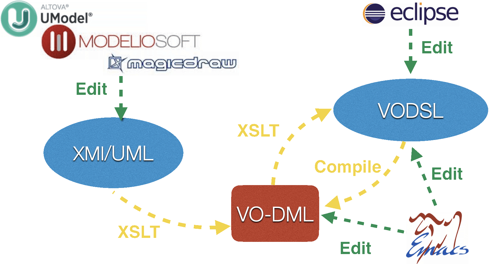

Writing VO-DML Models
=====================

Authoring Ecosystem
-------------------




Although VO-DML/XML is the standard serialization of VO-DML models, and it is possible to create VO-DML directly
by editing in a text editor (and the [model schema](https://github.com/ivoa/vo-dml/tree/master/xsd/vo-dml-v1.0.xsd) might be helpful in guiding this editing), it is generally easier to model using either

* [VODSL](VODSL.md)
* [UML](UML.md)


It is possible to import existing data models by;

1. Adding the published jar as a dependency in the `build.gradle.kts` file, e.g.
```kotlin
dependencies {
    implementation("net.ivoa.vo-dml:ivoa-base:1.0")
}
```
the tooling then makes sure that the model files are available for local import.
1.  Importing into the model file, and there are two cases whether VO-DML or VODSL is considered the 'working source'

    1. VO-DML - the tooling only requires the file name (it automatically creates an XML catalog which can resolve to  the absolute path)
```xml
<import>
    <name>ivoa</name>
    <url>IVOA-v1.0.vo-dml.xml</url>
</import>

```

    1. VODSL - a relative path import should be used - the tooling automatically creates a vodsl file to import into the `build/tmp` directory so that the
   exact form of the relative path depends on where the including source file is located.
```
include "../../build/tmp/IVOA-v1.0.vodsl"
```