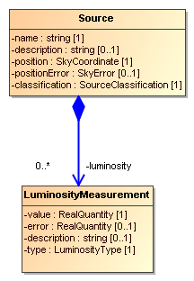
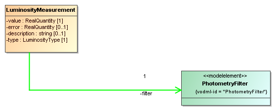

**Working Groups: Data Model**

**This version:**


**Latest version:**

<http://ivoa.net/documents/VODML/20180905/index.html>

**Previous version(s):**

<http://ivoa.net/documents/VODML/20180519/index.html>


**Status of This Document**

*This document has been produced by the Data Model Working Group.\
It has been reviewed by IVOA Members and other interested parties, and
has been endorsed by the IVOA Executive Committee as an IVOA
Recommendation. It is a stable document and may be used as reference
material or cited as a normative reference from another document.
IVOA\'s role in making the Recommendation is to draw attention to the
specification and to promote its widespread deployment. This enhances
the functionality and interoperability inside the Astronomical
Community.*

*A list of [current IVOA Recommendations and other technical
documents](http://www.ivoa.net/Documents/) can be found at
http://www.ivoa.net/Documents/.*


# Introduction

The key element for achieving interoperability among actors sharing data
is the definition of shared Standard Data Models.

The Wikipedia entry for *Standard Data Model* states:

*A **standard data model** or industry standard data model (ISDM) is
a data model that is widely applied in some industry, and shared amongst
competitors to some degree. They are often defined by standards bodies,
database vendors, or operating system vendors.*

*When in use, they enable easier and faster information sharing because
heterogeneous organizations have a standard vocabulary and
pre-negotiated semantics, format, and quality standards for exchanged
data. The standardization has an impact on software architecture as
solutions that vary from the standard may cause data sharing issues and
problems if data is out of compliance with the standard.*[^1]

Interoperable modeling is a much more challenging enterprise than usual
application- or organization-centric data modeling in that the standard
data models need to be adopted in many different contexts, like software
applications, database management systems, serialization formats, web
services, and across different organizations, programming languages,
operating systems. For this reason, stricter rules should be imposed on
standard data models so that a broad range of applications can be
supported.

This specification has three main goals:

1.  Provide a set of formal rules for data modeling in the IVOA in order
    to ensure that the resulting models can be consistently used by many
    different actors, from data publishers to end users, including
    application developers, and using different technologies.

2.  Provide a standard, machine-readable representation for IVOA Data
    Models.

3.  Define a *portable Data Model reference format* for pointing to Data
    Models and the elements they define.

Item 3 is particularly important because it takes into account the
existing file formats in use in Astronomy that cannot be replaced by XML
or other common languages for representing data models. So, while VO-DML
makes indeed use of XML, it also defines standardized portable pointers
that can be used in many serialization formats to refer to Data Models
and their elements.

Section 2 more formally and technically introduces how VO-DML is
relevant to the IVOA from a Data Integration perspective. Section 3
describes the contents of this specification and some non-normative
aspects. Section 4 contains the first normative part of this
specification, describing the details of the modelling language. Section
5 describes a special data model, named \'ivoa\', that predefines a
number of standard primitive types and some types representing IVOA-like
quantities (value with unit). All other IVOA data models SHOULD use this
model, as it allows one to have a consistent set of the types at the
leaves of the type definition hierarchies. Section 6 contains guidelines
for the proper data modeling process in the IVOA, endorsed by the IVOA
Data Modeling Working Group.

Various appendices provide supplementary material that may help in using
this specification.

Appendix A contains a table that for each important VO-DML concept lists
the corresponding UML concept with hyperlink and short comment. This
could be used as a summary of the main specification. One may wish to
compare VO-DML and VO-DML/Schema to alternative languages such as
RDF-Schema or OWL \[19\], or similar approaches to designing
domain-specific modeling languages such as Ecore \[18\].

A short overview how one might map VO-DML data models to meta-models for
application specific serialization and/or instantiation formats is given
in Appendix B. Such a mapping can be considered *physical models*
implementing a *logical model* defined in VO-DML. Examples discussed
there are mappings to XSD \[24\], to the relational database model and
Java. That appendix also contains a discussion on the possible need for
and a design of an application neutral serialization language
specifically tailored to VO-DML, referred to as VO-DML/I.

Serialization of Data Model instances in VOTable format is provided in a
related document \[3\]. It is important to note, however, that any
number of serialization strategies can be created for any number of
corresponding file formats using the portable references (vodml-id)
defined in this specification. Such strategies only need to be defined
once and for all for each format, and apply to all Data Models, as long
as they are formally described in a VODML/XML document.

Appendix C discusses a possible set of rules for deriving the vodml-id
of a model element from the actual model.

Appendix D introduces the sample data model that is used in this
specification.

## The role in the IVOA architecture

This specification defines a language for expressing data models for the
IVOA and is the core of the mapping specification language for
expressing how data model *instances* are stored in VOTables and other
tabular serializations such as TAP.

{width="6.0in" height="4.5in"}

Note that in the diagram not all existing DMs are represented. This
specification *is* supposed to apply to all models.

# Data Integration 

The home page of the IVOA web site states that:

*The Virtual Observatory (VO) is the vision that astronomical datasets
and other resources should work as a seamless whole.*[^2]

While Wikipedia states that:

***Virtual observatory** (VO) is a collection of interoperating data
archives and software tools which utilize the internet to form a
scientific research environment in which astronomical research programs
can be conducted.*

These characterizations of the VO are very similar to the various
definitions of *data integration* one encounters when searching the web,
such as

***Data integration** involves combining data residing in different
sources and providing users with a unified view of these data.*[^3]

***Data integration** involves combining data from several disparate
sources, which are stored using various technologies and provide a
unified view of the data*[^4]*.*

And from Chapter 9 in \[1\], which we will use in much of this
introduction

*The goal of data integration is to provide a uniform access to a set of
autonomous and possibly heterogeneous data sources in a particular
application domain.*

In fact, the Virtual Observatory can be seen as what \[1\] calls a
*virtual* data integration effort: the data remain in their data
sources; the integration is performed only when the data is needed, say
during a query. The unified view of the data in such data integration
projects is provided by what is commonly called a *global schema*. The
global schema aims to represent, in a unified view, the information
contained in the source databases pertaining to a certain domain, or
*universe of discourse*.

The goal of data integration projects such as the VO is to provide end
users with a view of the source databases based on this schema. For
example, users could be allowed to submit queries phrased in terms of
this schema rather than in terms of the schemas of the underlying
databases. Or serialized data sets should be expressed using terms of
the global schema. Or it should be possible to write code against
programming APIs designed according to the global schema.

The central problem of both IVOA and data integration in general is that
the source databases generally do not conform to any common schema one
might wish to design. The source databases have generally been created
to serve the purposes of the entity/organization that owns them, without
coordination between the different providers to align their designs.
This shows itself in two ways: First is what one might call *technical
heterogeneity*; source databases are built using different technologies
or use different formats. Experience in the VO shows that this can be
solved: owners of the data are willing to describe their data holdings
in some standardized format and abide by some standard access protocols
(e.g. TAP), or send their data over the net in some standardized
serialization format (e.g. VOTable).

What is much harder to solve and is the target of the current work as
well as the related *Mapping to VOTable* specification \[3\], is what is
called in \[1\] *semantic heterogeneity*. Source databases contain
information from possibly overlapping but not identical subsets of the
whole problem domain, and even where there is overlap in contents, the
design will generally be different. The source databases were generally
built according to local specifications, targeting different subsets of
the overall domain (Astronomy for the VO), and the designs use
particular *views* of the schema optimized for particular applications
and/or implementations.

So even if all source databases are relational, the actual data models
they use are different and data providers will in general be unwilling
or unable to change the structural design of their data holdings, or the
contents of the serializations, to conform to some uniform, global
design. Instead a mapping must be provided between the source schemas
and the global schema. In the literature the components providing this
mapping are often referred to as *mediators*.

The link between the global schema and the various *data models* defined
in the IVOA is easy to see. Similar to global schemas, data models in
the IVOA have a particular goal, namely to facilitate interoperability
of distributed data sources. They can provide serialization formats for
the results of protocols such as the spectrum data model in SSAP \[23\]
or can provide a common relational schema as in ObsCore+ObsTAP \[24\].

*Mediators* are not as easily identified or isolated, but they must be
hidden somewhere inside the different implementations of the various
IVOA access protocols. For example in an implementation of SSAP a
special code component may translate some native representation of a
spectrum into one of the few allowed forms allowed by the protocol. And
in ObsTAP one may be able to define database views on the native schema
to represent the ObsCore table(s).

The two examples mentioned above, SpectrumDM+SSAP and ObsCore+ObsTAP,
are not the only, or even most common data integration patterns in the
IVOA. What distinguishes these from other approaches is that a data
model is represented *faithfully*, i.e. the protocol serializations
produced by the protocol, or the database design exposed by the data
providers, is basically a one-to-one representation of the common data
model defined by the standard. Especially ObsTAP is a nice example of a
pattern that is equivalent to the data integration pattern called
*global-as-view*. The global schema can sometimes literally be
implemented as a collection of database views on the source schemas.
These views show *how* the entities from the global schema are
represented in *and* how they can be extracted from the source
database[^5].

In the IVOA this pattern is still rare. The more common way by which one
may obtain knowledge about the contents of some data source in
standardized terms is through *annotations*. Data sets are represented
in some standardized format that includes hooks for associating terms
from a standardized source of semantic information. In the IVOA the main
representations that allow this are the metadata annotation elements in
VOTable \[4\] and the TAP_SCHEMA[^6] in the TAP specification \[5\].
Each of these contains hooks for linking certain data components to the
UCD semantic vocabulary (see \[6\] and \[7\]). Associating a term from
that controlled list to say a FIELD (VOTable) or column (TAP) indicates
that those elements represent the concept identified by the term.

It was recognized that apart from the controlled vocabularies, also the
various data models defined for varying purposes within the IVOA contain
semantic information. Maybe it would be possible to provide a mechanism
similar to the UCD annotations that would allow one to associate
elements from a data source with elements inside these models. The
*utype* attribute was defined in VOTable to represent such \"pointers
into a data model\".

What these were supposed to point at was left unspecified in the VOTable
specification, the current specification provides that definition. This
specification defines a formal language for defining IVOA data models.
Data models defined in this language contain explicitly identified data
model elements that can be formally referenced using a namespace-like
mechanism for avoiding name clashes among different Data Models.[^7]

The language defined here is called *VO-DML*, which stands for *Virtual
Observatory Data Modeling Language*. VO-DML is designed to satisfy the
following requirements. It should

1.  Support the specification of serialization strategies for
    serializing instances of data models into different file formats;

2.  Be rich enough to represent existing IVOA data models;

3.  Support model reuse;

4.  Be implementation-neutral, but\...

5.  Be flexible enough to be mapped to important physical
    representations, in particular XML schema, relational model (TAP),
    object-oriented languages (Java, Python\...), and at the same
    time\...

6.  Be as minimal as possible, avoiding redundancy, adding restrictions
    where possible, with the aim of simplifying the work of modelers by
    offering few and "obvious" choices;

7.  Be based on accepted standards for data modeling, but \...

8.  Not *rely* on external modeling tools[^8], but be sufficiently
    compatible with them so that such tools MAY be used when
    representing models;

9.  Support runtime model interpretation;

The data modeling language defined in this document fulfills these
requirements.

The language is explicitly implementation neutral, but has been
successfully used as the source for transformation scripts that produce
various representations such as a fully hyper-linked HTML document and
Java classes used to infer data model instances form suitably mapped
VOTables[^9]. The formal representation language is XML that can be
easily hand coded, but also has a non-normative UML (\[12\], \[13\])
representation that can be translated into VO-DML automatically. Finally
the model representation language can be used in validating VOTables
annotated using vodml-ids.

Applications making use of VO-DML XML descriptions can be agnostic of
the actual models, but can successfully retrieve, parse and load those
at runtime.

The VO-DML specification consists of a conceptual part and a model
definition language. The latter defines an XML format and this
specification states that all data models in the IVOA MUST have a
representation in that format. The conceptual part of the spec goes by
the name of **VO-DML**, short for VO Data Modeling Language. The
serialization language goes by the name of **VO-DML/Schema** and an XML
document conforming to this standard defines a data model, and is
referred to as the **VO-DML/XML** representation of that data model.

The language can be expressed graphically using a subset of UML. For
this purpose a UML Profile[^10] is defined that represents the VO-DML
concepts in UML. This is referred to as **VO-UML**, but its definition
is *informative*, *not* a normative part of the spec. These four
different representations will be discussed in more detail in the next
section. Section 3 then defines each modeling concept in detail and
illustrates their usages in the different representations. Section 4
defines normative rules how to define data models in the IVOA and gives
some non-normative *best practices* guide lines. Auxiliary material is
contained in the appendices.

# VO-DML, VO-UML, VO-DML/Schema and VO-DML/XML

This specification distinguishes between the conceptual meta-model,
**VO-DML** and the XML based serialization language for expressing data
models, referred to as **VO-DML/XML**. The latter is defined using an
XML schema together with a Schematron[^11] file defining further
constraints and is referred to in combination as **VO-DML/Schema**. The
relation between VO-DML and VO-DML/XML is equivalent to the relation
between a UML \[12\] (see also \[16\]) model and its representation as a
file in the XML serialization format XMI \[15\]*.* VO-DML is directly
derived from UML in the sense that most of its modeling constructs have
a counterpart in UML. One can in fact interpret VO-DML as a UML
*Profile* \[16\], a domain specific \"dialect\" of UML. This is made
explicit in this specification by providing a (non-normative) UML
representation of VO-DML, referred to as **VO-UML**.

These different components of the specification are discussed in some
more detail in the next subsections.

## VO-DML/XML + VO-DML/Schema

For most use cases a VO-DML data model must be serialized in a computer
readable format. The serialization language to be used for this is
referred to as VO-DML/XML. A VO-DML/XML document is an XML document that
must conform to a formal syntax defined by an XML schema[^12],
vo-dml.xsd[^13] and must further validate under the rules defined in an
associated Schematron file, vo-dml.sch.xml[^14]. These files implement
all the concepts described in section 4 The schema files are
self-documented as much as possible, and in what follows only a few
details of the overall design, focusing on technical aspects of the
implementation, are given.

VO-DML/XML is a simple representation of a VO-DML model as an XML
document. The fact that this specification defines a custom designed
serialization language rather than using some existing language could be
seen as an unnecessary complication. One *could* for example also
consider using XMI as the standard for serializing VO-DML models.
However, XMI is a rather unwieldy format that hides many of the features
that are made explicit in this specification. Hence as a language from
which to derive information of the model without very sophisticated
tools it is ill-suited. Also one should not assume all users have access
to a UML modeling tool that can support all the UML modeling features
needed to create VO data models, and hand-editing XMI is nigh
impossible. It is also foreseen that users may want to derive models
from other representations (e.g. XML schema, or RDF) and XMI as target
language for such a tool requires deep understanding of its format,
which is not necessary for the simple language proposed here.

VO-DML/XML is a useful language for serializations, in particular
because, being completely under control of the IVOA DM WG, it can be
tailored to the requirements deriving from its usage in the IVOA. This
provides more freedom to restrict the format and implement the
appropriate constraints. This is formal in the sense that VO-DML/XML
files MUST conform to these specifications. The implementation of VO-DML
provided by these files is referred to as VO-DML/Schema. VO-DML/Schema
is a direct implementation of the VO-UML profile: it exposes all
modeling concepts explicitly, and ignores the many UML/XMI features that
are not needed.

## VO-DML + VO-UML

VO-DML defines the concepts used to create data models in the IVOA. It
uses a small subset of the components from UML Class Diagrams[^15] and
hence follows an object-oriented approach. VO-DML restricts itself to
structural constructs only; operations are explicitly excluded from our
language. Constraints are supported, but in a very limited manner.

A great strength of UML is its formal graphical language and though only
a VO-DML/XML representation of a model will be required for IVOA data
models, human-readable graphical representations are extremely useful to
interpret and understand a model. Until a graphical VO-DML tool exists,
modelers can use one of the many available UML modeling tools to create
such a representation.

VO-UML has been expressed at least in one such UML modeling tool as a
UML *profile*, using *stereotypes* with *tag definitions* to enable
modeling of domain specific components in the graphical tool and to
facilitate automated generation of VO-DML/XML from the XMI in which the
UML model was serialized.

But note, though VO-UML is used for illustrations, and has been used to
define some models, the VO-DML specification is *not dependent* on UML
or any tools for defining models in UML. VO-DML data models need not
have a UML representation, but they MUST have a serialization in terms
of VO-DML/XML (see section 5 for details on how to define data models).
Hence the VO-UML part in this spec is INFORMATIVE, not NORMATIVE. But if
a UML representation is provided, it SHOULD restrict oneself to those
UML elements that match the VO-DML concepts as defined in this
specification. This will further facilitate the application of tools for
generating VO-DML/XML from the UML directly.

## This specification 

Section 4 defines all the major components of the VO-DML meta-model.
Each subsection defines a concept in its title and contains a
description of its meaning at the conceptual, VO-DML level. In
appropriately titled sub-sub-sections it lists and describes all the
sub-components.

As the VO-DML modeling language can be interpreted as a subset of the
UML modeling language, this document is basically a listing of those UML
components that are part of the language with a description how they are
used, restricted and in some cases renamed. This link is made explicit
in the sections headed with the phrase **VO-UML**. Those sections
identify the UML concepts, or *meta-class*, from UML version 2.4.1
\[13\] that is closest in meaning to the VO-DML concept and provide
hyperlinks to the rather more readable UML Diagrams website \[16\].

Where appropriate[^16] the **VO-UML** section also contains a sample
graphical representation of the concept using snippets from a sample UML
model described in Appendix D. This is a toy data model for astronomical
Source-s and is designed specifically to illustrate most of the modeling
constructs. See the appendix for details on where its different
representations can be found. The diagrams for this model were created
using a particular UML modeling tool (MagicDraw Community Edition 12.1).
This version supports UML 2.0[^17], serializing its models to XMI
2.1[^18]. An explicit UML *Profile*[^19] was created to represent also
those VO-DML concepts that do not have a direct UML counterpart. This
Profile contains definitions for stereotypes with tags that allow us to
extend the definition of certain UML elements so that these *can* be
directly mapped to VO-DML.

Applications aiming to automate generation of a VO-DML/XML
representation directly from the UML model may benefit from this
Profile. They may, for example, use the XMI serialization of the UML
model as source for an XSLT script. UML modeling tools may support a
similar Profile-based approach, or may have to use different means by
which to capture those VO-DML concepts that do not directly map to the
UML version they support[^20].

This graphical representation of VO-UML is *not* normative, but modelers
are strongly urged that *if* they use UML to illustrate their models
they use its design principles in constructing the diagrams. In
particular they should have a mapping from VO-DML concepts to UML and
obey the constraints implied by this mapping[^21].

In spite of its relation to UML, ultimately VO-DML should be expressed
in a VO-DML/XML document conforming to the formal VO-DML/Schema
documents.

This specification document can therefore also be seen as an explanation
of those documents. Each VO-DML concept listed in the next section has a
counterpart in the schema, which is replicated in shortened form in the
section headed with the term **VO-DML/SCHEMA**. The full definition can
be found in the corresponding schema documents that accompany this
specification. To repeat, this schema *is* normative. I.e. all models
compliant to the VO-DML standard MUST be defined by a VO-DML/XML
document, which MUST conform to the schema and schematron files, as well
as by any rules and constraints written in the current document that may
not have been implemented explicitly in the schema.

Most subsections will also contain a section headed **VO-DML/XML**,
which contains an example XML snippet extracted from the VO-DML/XML
representation of the sample model in Appendix D.

The fact that different representations of VO-DML are used, sometimes in
the same sentences, could make it difficult to understand which
representation one is referring to when using a named concept. In an
attempt to prevent this, the following notation is used to indicate
which representation is intended: references referring to a VO-DML
*concept* are in **boldface**; references to an XML schema
implementation of a concept are in courier font; references to a UML
concept are in *italics*.

# VO-DML Language Specification \[NORMATIVE\]

This section defines all the elements from the VO-DML meta-model. The
order in which the elements appear is roughly based on a dependency
hierarchy between the meta-elements, which is visualized in the diagram
in Figure 1. That diagram shows a representation of the VO-DML
meta-model as a UML-like diagram. It leaves out most of the details,
focusing on the inheritance hierarchy between the meta-model concepts
represented by the boxes. This diagram is inspired by the first diagram
in \[18\], which shows the components of the Ecore meta-model used in
the Eclipse Modeling Framework[^22].

{width="6.0in"
height="2.833015091863517in"}

Figure : UML-like diagram of the main components of the VO-DML
meta-model.

More detailed diagrams are shown in Figure 2 and Figure 3. These
diagrams also show the attributes and non-inheritance relations between
the concepts. Note that these diagrams are not VO-UML diagrams and
certain rules of VO-DML are not obeyed here[^23]. It is purely meant to
illustrate the meta-model and allow comparison with the similar diagrams
in the *Ecore* meta-model in \[18\].

{width="3.6145833333333335in"
height="3.7395833333333335in"}

Figure : The structure of a Model, consisting of packages, various types
and possibly imported models.

The subsections in this chapter have titles that name the concepts.
Abstract elements have a slanted title. Child components have in general
a title that follows the name of the element, separated by a colon.
References to other elements are implemented as much as possible using
hyperlinks. When primitive types are needed, the names from the basic
\"IVOA\" data model introduced in section 5 are used. These names are
common and the model is not really required to understand their meaning.
Ultimately the XSD representation of each element is normative and it
uses the standard set of primitive types such as xsd:string etc.

{width="6.426814304461942in"
height="5.570370734908137in"}

Figure Detailed view of the meta-model hierarchy below
*ReferableElement*. Composition and reference relation are indicated as
well as attributes.

## *ReferableElement* 

A data model consists of model elements of various types. In the
VO-DML/XML serialization almost all of these MUST have an explicit
identifier element that makes it possible for them to be explicitly
referenced, either from inside the model, or from an external context.
VO-DML/Schema defines the abstract type ReferableElement that is a
super-type of all types representing such referable concepts. It
contains an identifier element named vodml-id that MUST be unique within
the model.

Note that for convenience vodml-id SHOULD be human-readable, following
to the grammar defined in Appendix C. While this is not obligatory,
since vodml-ids are only required to be unique in a model, it is
convenient for a human confronted by such an identifier to intuitively
infer its meaning. Following a standard grammar improves consistency
among data models.

All referable elements also have a **name**, and a **description**. The
name SHOULD be used to derive the vodml-id from the structure of the
model, as described in Appendix C.

The name must often be unique within the direct context where a
particular referable element is defined. For example all **Types**
defined as direct children of a **Package** must have a name that is
unique in the context of that package. Similarly **Attributes** must be
unique in the definition of the **Type** they are defined in; in fact
this must be true for the whole collection of **Roles** in the
inheritance hierarchy of the type.

VO-UML

Closest UML meta-class:
[*NamedElement*](http://www.uml-diagrams.org/uml-core.html#named-element).
\[§7.3.34 in \[13\][^24]\].

**ReferableElement** does not have its own graphical element, but has a
representation in VO-UML as the stereotype \<\<modelelement\>\>. That
stereotype defines a tag \'vodml-id\'. When assigning the stereotype to
a particular model element one *can* define an explicit value for the
vodml-id of the element, rather than the default value that is the one
generated from the VO-UML itself using the grammar described in Appendix
C below. In spite of this possibility, modelers SHOULD NOT define custom
vodml-id, as the grammar offers an explicit, human readable expression
that gives some hints as to the location of the element in the model.
The main reason to do so is to use values from old lists of utype-s for
example.

{width="1.6666666666666667in" height="0.75in"}

Figure VO-UML type with an explicit \<\<modelelement\>\> stereotype.
This allows one to explicitly assign a vodml-id, possibly overriding the
one that would be automatically assigned using the algorithm in Appendix
C.

VO-DML/Schema

All main modeling elements in the VO-DML XSD (apart from Model) extend
ReferableElement. This abstract base class has an identifier element
\<vodml-id\>, the value of which must be unique in the model. This means
that these elements can be referenced using this identifier. In VO-DML
this is used explicitly in the ElementRef type that expresses such
references inside the meta-model using a \<vodml-ref\> element. The type
definitions for vodml-id is that of a restricted string, the details of
which are expressed in the following XML Schema snippet.


```xml

<xsd:simpleType name="VODMLID">
    <xsd:restriction base="xsd:string">
        <xsd:pattern value="\[*a-zA-Z*\]\[*a-zA-Z0-9\_\\.\]\**"/>
    </xsd:restriction>
</xsd:simpleType>
<xsd:complexType name="ReferableElement" abstract="true">
<xsd:sequence>
    <xsd:element name="vodml-id" type="VODMLID" minOccurs="1"/>
    <xsd:element name="name" type="xsd:string" minOccurs="1"/>
    <xsd:element name="description" type="string" minOccurs="0"/>
</xsd:sequence>
</xsd:complexType>
``` 

VO-DML/XML

As ReferableElement is abstract, there are no direct examples of its
usage, only through types derived from it.

### vodml-id : VODMLID \[1\]

Identifier for the containing model element. Syntax in VO-DML/XML
defined by the VODMLID type, as shown in the VO-DML/Schema snippet
below.\
This element MUST be formatted according to the regular expression in
the XML schema:

> \[a-zA-Z\]\[a-zA-Z0-9\_\\.\]\*

The value assigned to an element MUST be unique in the document and is
case sensitive.

The only requirement on the \<vodml-id\>
identifying model elements is that it is unique within the context of
the model. However, it may be useful for such IDs to be human-readable,
so to intuitively provide information about the elements they identify.
This specification states that vodml-id SHOULD be made human-readable
according to specific rules that represent the location of the
identified element in the model, encoded in the grammar presented below.

In the past[^42] rules have been defined for generating such unique
identifiers for elements in a data model, and the following grammar is
built starting from that previous attempt. Note that uniqueness depends
on rules on the uniqueness of names in a particular context, here
represented by a location in a hierarchy:

```bnf
vodml-id := package-vodml-id | type-vodml-id |

attribute-vodml-id | composition-vodml-id |

reference-vodml-id | container-vodml-id

package-vodml-id := <package-name>
["." <package-name>]*

type-vodml-id := [package-vodml-id "."] <type-name>

attribute-vodml-id := type-vodml-id "." <attribute-name>

composition-vodml-id :=

type-vodml-id "." <composition-name>

reference-vodml-id := type-vodml-id "." <reference-name>

container-vodml-id := "vo-dml:Object.CONTAINER"

vodml-ref := <model-name> ":" vodml-id
```

The grammar for the vodml-ref reference to an element identified by the
vodml-id identifier is also included above for convenience.


### name : xsd:NCName \[1\]

The name of the model element. The name MUST conform to the following
XML Schema pattern defined in the VO-DML/XSD:

> \[a-zA-Z\]\[a-zA-Z0-9\_\]\*

Names are often restricted by uniqueness constraints in subclasses of
**ReferableElement**. For examples names of **Types** must be unique
within their containing **Package**, **Role** names must be unique
within their containing **Type** etc.

### description : string \[0..1\]

Human readable description of the model element. Note the multiplicity
constraints. In principle every model element SHOULD have a meaningful
description, but no tool will be able to check whether a certain
description is correct. Since a meaningless string can easily be
provided if one wants to evade a possible not null constraint, the
description may be null.

## ElementRef

To refer to a [ReferableElement](#referableelement) from inside a
VO-DML/XML data model document, for example to indicate the data type of
an [**Attribute**](#attribute-extends-role) or other
[**Role**](#role-extends-referableelement), one must use an ElementRef.
This contains a single element named vodml-ref, the value of which MUST
be the exact vodml-id of the referenced element (which MUST of course
exist), is case-sensitive, and MUST be prefixed by the name of the model
the referenced element belongs to. This can be the same model as the one
containing the referencing element, or it may be a model
[imported](#modelimport) by the current model.

VO-UML

This type has not explicit counterpart in VO-UML, though XMI\'s
xmi:idref is similarly playing the role of referring to other elements
in the model. In VO-DML, **ElementRef**-s may refer to elements defined
in an external, imported model without explicit representation in the
model that uses the type.

VO-DML/Schema

```xml

<xsd:simpleType name="VODMLREF">
    <xsd:restriction base="xsd:string">
        <xsd:pattern
                value="\[a-zA-Z\]\[a-zA-Z0-9\_\\-\]\*:\[a-zA-Z\]\[a-zA-Z0-9\_\\-\\.\]\*"/>
    </xsd:restriction>
</xsd:simpleType>
<xsd:complexType name="ElementRef">
<xsd:sequence>
    <xsd:element name="vodml-ref" type="VODMLREF">
    </xsd:element>
</xsd:sequence>
</xsd:complexType>
```

VO-DML/XML

Any usage of one type by another type, be it as data type of an
attribute, or as target type of a relation, will give rise to an
ElementRef definition in the corresponding VO-DML/XML. This generally
just means the element contains a \<vodml-ref\> element that must
conform to the syntax in the schema as in the following example.

```xml
<datatype>
<vodml-ref>ivoa:string</vodml-ref>
</datatype>
...
```

See many more examples further on in this specification.

### vodml-ref : string \[1\]

The element identifying the referenced target element. The syntax of the
vodml-ref consists of the name of the model, a colon \':\' and the
vodml-id of the referenced element. In mock BNF:

```bnf
<vodml-ref> :== <model-name>
':' <vodml-id>
```

## Package extends [*ReferableElement*](#referableelement)

**Packages** divide the set of types in a model in subsets that are
semantically related[^25], providing these with a common namespace:
their names must be unique in this context only. A package may contain
child packages. This concept is similar to for example an XML namespace,
a Java package or a schema in a relational database.

A package uses explicit element names for each of the type classes:
\<objectType\>, \<datatype\>,\<primitiveType\> and \<enumeration\>. This
avoids the need for xsi:type casting in serializations and facilitates
tracing path expressions.

VO-UML

UML meta-class:
[*Package*](http://www.uml-diagrams.org/package-diagrams.html#package)
\[§7.3.38\]

The graphical representation of a Package in UML is a tabbed rectangle
with name in the top of the rectangle as shown in Figure 5. Types owned
by the package may be shown inside the rectangle. Types may also have
the package name placed within parentheses below the name of the type.
See the Source type in the figure for an example of the latter.

{width="6.0in" height="3.7222222222222223in"}

Figure A package is represented by a tabbed rectangle. Types belonging
to it can be drawn inside it.

**VO-DML/Schema**

In VO-DML/Schema, **Package** is represented by a complexType of the
same name and extends ReferableElement.

```xml

<xsd:complexType name="Package">
    <xsd:complexContent>
        <xsd:extension base="ReferableElement">
        <xsd:sequence>
        <xsd:element name="objectType" type="ObjectType"
                     minOccurs="0"
                     maxOccurs="1"/>
        <xsd:element name="dataType" type="DataType" minOccurs="0"
                     maxOccurs="1"/>
        <xsd:element name="enumeration" type="Enumeration"
                     minOccurs="0" maxOccurs="1"/>
        <xsd:element name="primitiveType" type="PrimitiveType"
                     minOccurs="0" maxOccurs="1"/>
        <xsd:element name="package" type="Package" minOccurs="0"
                     maxOccurs="1"/>
    </xsd:complexContent>
</xsd:extension>
        </xsd:complexType>
```

**VO-DML/XML**

```xml

<package>
    <vodml-id>source</vodml-id>
    <name>source</name>
    <description>\...</description>
    <objectType>
        <vodml-id>source.LuminosityMeasurement</vodml-id>
        <name>LuminosityMeasurement</name>
        ...
```

### objectType : ObjectType^\[[→](#objecttype-extends-type)\]^ \[0..\*\]

Collection of ObjectTypes defined in this package.

### dataType : DataType^\[[→](#datatype-extends-valuetype)\]^ \[0..\*\]

Collection of DataTypes defined in this package.

### primitiveType : PrimitiveType^\[[→](#_Type_extends_ReferencableElement)\]^ \[0..\*\]

Collection of PrimitiveTypes defined in this package.

### enumeration : Enumeration^\[[→](#enumeration-extends-valuetype)\]^ \[0..\*\]

Collection of Enumerations defined in this package.

### package : Package^\[[→](#package-extends-referableelement)\]^ \[0..\*\]

Collection of child packages defined in this package.

## Model

A **Model** represents a complete data model. It represents a coherent
set of type definitions, by which it represents the concepts that have
an explicit place in its *universe of discourse*, i.e. the set of
concepts one can talk/\"discourse\" about in the model\'s context. In
VO-DML each data model is defined in a single document, but **Model** is
an explicit concept[^26] in VO-DML that is particularly important for
supporting model reuse through the **import** feature (see 4.4.10).

Note that although the vodml-id of model elements MUST NOT have the
prefix, references from model elements to other elements inside the same
model MUST use the full vodml-ref definition 4.2.1 , i.e. MUST include
the model\'s name as prefix.

**Model** has the following components, which have a 1-1 correspondence
in the VO-DML/Schema. See there for more extensive comments.

VO-UML

Derived from UML element:
[*Model*](http://www.uml-diagrams.org/package-diagrams/model.html)
\[§17.3.1\].

In UML a Model[^27] is a special kind of Package and is represented by
the package symbol with a triangle in the top right as shown in Figure 6

{width="1.5333333333333334in"
height="0.8666666666666667in"}

Figure UML representation of a Model as a special kind of package.

In the Profile used for these diagrams the root of the document
represents the model and a separate graphical element is not
required[^28]. The VO-UML profile contains a \<\<model\>\> *stereotype*
that can be assigned to a Model and which defines *tags* which allow one
to define extra metadata about the model and which correspond to the
metadata elements defined in the subsections below.

**VO-DML/Schema**

In VO-DML/Schema **Model** is represented by a complexType Model. It
contains definitions for model specific meta-data elements. **Model** is
furthermore represented by the single root element defined in the
schema, named model. This has type Model and has a uniqueness constraint
defined on the [vodml-id](#vodml-id-vodmlid-1)-s of all its contained
elements.

```xml

<xsd:complexType name="Model">
    <xsd:sequence>
        <xsd:element name="name" type="ModelName" minOccurs="1"
                     maxOccurs="1"/>
        <xsd:element name="description" type="xsd:string" minOccurs="0"
                     maxOccurs="1"/>
        <xsd:element name="identifier" type="xsd:string" minOccurs="0"
                     maxOccurs="1"/>
        <xsd:element name="uri" type="xsd:anyURI" minOccurs="1"
                     maxOccurs="1"/>
        <xsd:element name="title" type="xsd:string" minOccurs="1"
                     maxOccurs="1"/>
        <xsd:element name="author" type="xsd:string" minOccurs="0"
                     maxOccurs="unbounded"/>
        <xsd:element name="version" type="xsd:string" minOccurs="1"/>
        <xsd:element name="previousVersion" type="xsd:anyURI"
                     minOccurs="0"/>
        <xsd:element name="lastModified" type="xsd:dateTime"/>
        <xsd:element name="import" type="ModelImport" minOccurs="0"
                     maxOccurs="unbounded"/>
        <xsd:element name="package" type="Package" minOccurs="0"
                     maxOccurs="unbounded"/>
        <xsd:element name="objectType" type="ObjectType" minOccurs="0"
                     maxOccurs="unbounded"/>
        <xsd:element name="dataType" type="DataType" minOccurs="0"
                     maxOccurs="unbounded"/>
        <xsd:element name="enumeration" type="Enumeration" minOccurs="0"
                     maxOccurs="unbounded"/>
        <xsd:element name="primitiveType" type="PrimitiveType"
                     minOccurs="0" maxOccurs="unbounded"/>
    </xsd:sequence>
</xsd:complexType>
```

**VO-DML/XML**

```xml

<vo-dml:model xmlns:vo-dml="http://www.ivoa.net/xml/VODML/v1">
    <name>src/name>
        <description>This is a sample data model. \...

        </description>
        <uri>http://ivoa.net/vodml/source1.vo-dml</uri>
        <title>Sample VO-DML data model.</title>
        <version>0.x</version>
        <lastModified>2013-05-04T19:24:52</lastModified>
        <import>
            <name>photdm-alt</name>
            <version>1.0</version>
            <url>https://volute.g-vo.org/svn/trunk/projects/dm/vo-dml/models/sample/filter/Filter.vo-dml.xml</url>
            <documentationURL>https://volute.g-vo.org/svn/trunk/projects/dm/vo-dml/models/sample/filter/Filter.html
            </documentationURL>
        </import>
...
```

### name : string \[1\]

The short name and identifier for this model. A standard model\'s *name*
is assumed to be globally unique in the IVOA[^29]. Model definitions
that are not part of the IVOA standards but are intended to extend a
standard model SHOULD use the underscore character and a unique prefix
for their models, e.g. "gaia_src" in order to avoid name clashes with
other extensions from other authors. The name/identifier is also used as
the prefix in the construction of strings referencing the model with
that name, e.g. "src:Source".

For its role as prefix in VODMLREFs we restrict the valid values of the
model name to the following XML Schema pattern (defined in the ModelName
type in the VO-DML/XSD):

> \[a-zA-Z\]\[a-zA-Z0-9\_\\-\]\*

### description : string \[0..1\]

long description for the **Model**

### identifier : string\[0..1\]

A string holding the identifier by which the current model is registered
in an IVOA compatible registry. Its structure must therefore conform to
the IVOA Identifier specification \[28\]. If the model is an IVOA
standard, the naming authority for the identifier should be the IVOA DM
working group. See section 6 for more details on how data models are to
be registered.

### uri: anyURI \[1\]

Each model has an associated model URI that MUST be used to reference
it, for example in [ModelImports](#modelimport) or in VOTable
annotations. Dereferencing the model URI and following redirects yields
the latest VO-DML for the data model. In accordance to the proposal in
\[29\], the model URI must not contain minor versions. IVOA-approved
data models will have URIs of the form

[http://ivoa.net/vodml/\<name\>.vo-dml](http://ivoa.net/vodml/%3cname%3e.vo-dml),

where \'name\' will already contain the major version (as in, for
instance, *stc2*). The minor version of the model will be contained in
the *version* attribute defined below.

Non-IVOA providers of VO-DML files should follow the IVOA practice of
returning a *302 Found* redirect when dereferencing model URIs. The URI
redirected to should be stable for the exact version, including minor
and possibly micro releases, so that clients can easily determine what
actual file they are running against. This is primarily relevant for
debugging.

### title : string \[1\]

Long name for the **Model**.

### author : string\[0..\*\]

List of names of authors who have contributed to this model.

### version : string \[1\]

Label indicating the version of this model.

### previousVersion : anyURI \[0..1\]

URI identifying a VO-DML model that is the version from which the
current version of model is derived.

### lastModified : dateTime \[1\]

Timestamp when the last change to the current model was made.

### import : [ModelImport](#modelimport) \[0..\*\]

An \'import\' element indicates a dependency on an external, predefined
VO-DML data model. Types from that model may be referenced, extended, or
assigned to attributes as data types. Types from the external model MUST
NOT be used for composition relationships.

### package : Package^\[[→](#package-extends-referableelement)\]^ \[0..\*\]

Collection of child packages defined in this model.

### objectType : ObjectType^\[[→](#objecttype-extends-type)\]^ \[0..\*\]

Collection of ObjectTypes defined directly under the model.

### dataType : DataType^\[[→](#datatype-extends-valuetype)\]^ \[0..\*\]

Collection of DataTypes defined directly under the model.

### enumeration : Enumeration^\[[→](#enumeration-extends-valuetype)\]^ \[0..\*\]

Collection of Enumerations defined directly under the model.

### primitiveType : PrimitiveType^\[[→](#_Type_extends_ReferencableElement)\]^ \[0..\*\]

Collection of PrimitiveTypes defined directly under the model.

## ModelImport

A **Model** can **import** (see 4.4.10) another **Model**. This implies
that elements of the imported **Model** are used in the definition of
elements in the current **Model**. For example when Types from another
model are assigned to Roles, or when a Type inherits from a Type in
another model, then that model MUST be imported. In a VO-DML model
document the imported **Model** is represented by a **ModelImport**
element that contains metadata components identifying the remote model
and its documentation, as well as its name that must be used as prefix
when referring to elements in the imported model.

Note that only models that are directly used, or whose types are
extended must be imported. But model import is not transitive. For
example, if model A uses model B, and model B uses model C (but model A
does not), only model B must be imported in model A. But if model A
*does* use elements from model C explicitly, than A MUST import model C
as well[^30].

VO-UML

Relevant UML meta-classes:
[*Model*](http://www.uml-diagrams.org/package-diagrams/model.html).
\[§17.3.1\],
[*PackageImport*](http://www.uml-diagrams.org/package-diagrams.html#package-import)
\[§7.3.40\],
[*ElementImport*](http://www.uml-diagrams.org/package-diagrams.html#element-import)
\[§7.3.15\]

A **ModelImport** is represented by a child **Model** element with
IVOA-Profile stereotype \<\<modelimport\>\>. Graphically it is
represented by a Model element (see Figure 6) that may contain type
proxies. The latter are a pure VO-UML feature and not part of the VO-DML
language. They are types that MUST use IVOA-Profile stereotype
\<\<modelelement\>\> and provide a value for the \'vodml-id\' tag.

{width="5.516666666666667in"
height="2.2083333333333335in"}

Figure Graphical representation of an imported model. Note the usage of
the stereotype \<\<modelimport\>\> and the values assigned to the
various tags. Also shown is a type imported with the model. It must have
an explicit vodml-id assigned, which is accomplished using the
\<modelelement\>\> stereotype (see 4.1 ).

VO-DML/Schema

```xml

<xsd:complexType name="ModelImport">
    <xsd:sequence>
        <xsd:element name="name" type="xsd:string" minOccurs="1"/>
        <xsd:element name="identifier" type="xsd:string"
                     minOccurs="1"/>
        <xsd:element name="version" type="xsd:string"
                     minOccurs="1"/>
        <xsd:element name="url" type="xsd:anyURI"
        */*>
        <xsd:element name="documentationURL" type="xsd:anyURI"/>
    </xsd:sequence>
</xsd:complexType>
```
VO-DML/XML

See 4.4.10.

### name : string \[1\]

Name by which imported model is used in the current model and its
documentation. This name MUST be the same as the \'name\' given to the
imported model in the VO-DML document from which it is imported. Each
vodml-ref (4.2.1 ) pointing to an element in the imported model MUST use
this name as prefix.

### identifier : string \[0..1\]

The IVOA identifier by which the imported modeled is registered in an
IVOA registry.

### version : string \[1\]

Version of the imported model.

### url : anyURI \[1\]

URL from which the imported VO-DML model document can be downloaded.

### documentationURL : anyURI \[1\]

URL where a documentation HTML file for the remote model can be
downloaded. This SHOULD be a document that contains anchors for each
element that has as name attribute the vodml-id of that element. I.e. it
is assumed that the vodml-id-s of the imported types can be added onto
this documentationURL as fragments so that a direct link to the
documentation for a referenced data model element can be found.

## *Type* extends [*ReferableElement*](#type-extends-referableelement)

The ultimate goal of any VO-DML data model is to describe a part of the
world. The world is assumed to consist of *objects* of some type or
another. Instead of objects one could use the terms *individuals* (see
OWL for example), or *entities* (entity-relationship models).

The most important way the modeling language has for describing this
world of objects is by defining subsets of all these objects. In VO-DML
these subsets are referred to as **Types**. The Type defines a set of
properties that all objects in the set, also called *instances* of the
Type, possess. VO-DML assumes that every instance in the Universe of
Discourse, i.e. every object \"worth talking about\" in the context of
the model, must be explicitly assigned to one Type.

**Type** is abstract and is extended by ultimately four concrete
subtypes.

The most important[^31] categorization of **Types** is that between so
called **object types** and **value types**.

An **object type** represents a full-fledged, possibly very complex
concept in the real world and is built from properties and relations to
other object types. An important feature of object types as opposed to
ValueType-s (see below) is that instances of ObjectTypes, i.e. objects,
have their own, explicit identity[^32] that is defined independent of
the state of the object.

A **value type** represents a simple concept that is generally used as a
building block for defining more complex concepts up to object types. In
contrast to the latter, instances of ValueType-s, i.e. *values* need not
be explicitly identified. They are identified by their value alone. For
example an integer is a value type; all instances of the integer value
\'3\' represent the same integer. Not all value types are atomic though,
see **DataType** below.

Another way to express the difference between value types and object
types lies at the heart of why and how databases are built. The *extent*
of a value type, i.e. its set of valid instances/values, is
*self-evident from its definition*. That is, from the definition one can
infer exactly which values exist in the set defined by the value type.
Hence one can identify the instance by its value.

This is not the case for object types. Though one can define a Person
object type with say a name and a date-of-birth for example, one cannot
be sure that any combination of a name and a date will correspond to an
existing person. Moreover, two existing instances named \'Jane\' born on
Jan 12 1965 are not by definition the same (instance of) Person. For
object types it is therefore first a meaningful, non-trivial statement
to make that some instance exists, and second to assign an identity to
these instances that is independent of the state of the instance.

And this is precisely what a database does. One will never create a
database and store in it all integers, or all points on the unit sphere,
simply to make the statement that each of these exists. Their existence
is pre-defined by the definition of the sphere.

In contrast, one *does* create databases with information about persons,
possibly containing an integer attribute *age*. Or ones that store
sources observed on the sky, with their position represented by a point
on the sphere and an explicit identifier. Hence sources and persons are
represented by object types integers and \"points-on-the-unit-sphere\"
by a value type (a PrimitiveType for the former, a DataType for the
latter to be precise).

[]{#_extends:_ElementRef .anchor}

VO-UML

Relevant UML meta-classes:
[*Type*](http://www.uml-diagrams.org/uml-core.html#type) \[§7.3.52\],
[*Classifier*](http://www.uml-diagrams.org/classifier.html) \[§7.3.8\],
[Generalization](http://www.uml-diagrams.org/generalization.html)
\[§7.3.20\].

*Type* and *Classifier* are abstract meta-classes in UML and have no
graphical representation of their own. *Classifier* extends *Type* and
is itself the super-type of UML meta-classes *Class* and *DataType*
which are represented in VO-DML by
[**ObjectType**](#objecttype-extends-type) and the value types
[**PrimitiveType**](#primitivetype-extends-valuetype),
[**Enumeration**](#enumeration-extends-valuetype) and
[**DataType**](#datatype-extends-valuetype) respectively. All these
types are represented graphically by rectangles with at least the name
of the type and possibly the stereotype defining the particular \"type
of the type\", as shown in Figure 8.

{width="5.741666666666666in" height="1.1in"}

Figure Examples of the four different classes of types supported by
VO-DML and their representation. See the definition of the types for
more details.

The inheritance relationship is represented in UML by the
*Generalization* meta-class and graphically by an arrow (always red in
our profile) with a hollow arrow head from sub-type to super-type. In
UML *Generalization* is a special relation between types, in VO-DML it
is simply a pointer (ElementRef) from sub-type to super-type, owned by
the sub-type.

{width="1.8in" height="1.8416666666666666in"}

VO-DML/Schema

In VO-DML/Schema **Type** is represented by an abstract complexType
named Type. It is the base-type of all more concrete type definitions.
It extends ReferableElement, hence all type definitions can be
referenced and MUST have a \<vodml-id\> element. Types may be abstract,
in which case no instances can be produced (similar to for example
abstract classes in Java). They may also extend another type, which will
be referred to as the *super-type*. The super-type is identified by an
ElementRef.

```xml

<xsd:complexType name="Type" abstract="true">
    <xsd:complexContent>
        <xsd:extension base="ReferableElement">
            <xsd:sequence>
                <xsd:element name="extends" type="ElementRef"
                             minOccurs="0"/>
                <xsd:element name="constraints" type="Constraint"
                             minOccurs="0" maxOccurs="unbounded"/>
            </xsd:sequence>
            <xsd:attribute name="abstract" type="xsd:boolean" default="false" use="optional"/>
        </xsd:extension>
    </xsd:complexContent>
</xsd:complexType>
```

VO-DML/XML

For examples of type definitions see the definitions of the concrete
sub-types of **Type**. The following snippet is an example of the
extends relationship.

```xml

<objectType>
    <vodml-id>source.Source</vodml-id>
    <name>Source</name>
    ...

    <extends>
        <vodml-ref>src:source.AstroObject</vodml-ref>
    </extends>
    ...
```

### extends : [ElementRef](#elementref) \[0..1\]

VO-DML supports the object-oriented concept of inheritance, or
generalization, between **Types**. Generalization is a directed binary
association between a specialized sub-type and its more general
super-type (the target) identified through the **extends** property,
which is a reference to the target element.

It defines a sub-set relation between the set of instances defined by
the super-type and that of the sub-type: every instance of a sub-type is
also an instance of the super-type. In contrast to UML, VO-DML does not
support multiple inheritance, i.e. a type can have at most one direct
super-type. Furthermore ObjectTypes can only extend ObjectTypes,
DataTypes can only extend DataTypes etc.

Instances of sub-types inherit all the
[**Roles**](#role-extends-referableelement) and
[**Constraints**](#constraint) (see below) defined on the super-type.
This inheritance is applied recursively, i.e. a type also inherits the
roles and constraints its super-type has inherited.

### constraint : Constraint \[0..\*\]

Instances of a **Type** can be constrained by rules that define whether
they are valid instances. VO-DML allows two types of constraints:
Generic expressions in some computer-readable language, defined by the
[**Constraint**](#constraint) type itself, or
[**SubsettedRole**](#subsettedrole-extends-constraint)-s, which offers a
way to constrain elements of inherited Roles and extends Constraint.

## *ValueType* extends [*Type*](#type-extends-referableelement)

A **ValueType** is a special kind of **Type**, one whose instances are
*values*. See the discussion in the
[definition](#type-extends-referableelement) of **Type** for the details
on why **ValueType** is defined.

VO-UML

Nearest UML meta-class:
[*DataType*](http://www.uml-diagrams.org/class-diagrams.html#data-type).
\[§7.3.11\]

VO-DML has a special concept to represent all value types, whereas UML
uses *DataType* for this. VO-DML defines **DataType** (see 4.11 ) as a
special kind of **ValueType**.

VO-DML/Schema

```xml

<xsd:complexType name="ValueType" abstract="true">
    <xsd:complexContent>
        <xsd:extension base="Type">
        </xsd:extension>
    </xsd:complexContent>
</xsd:complexType>
```

## PrimitiveType extends [*ValueType*](#valuetype-extends-type)

A PrimitiveType represents an atomic piece of data, a *value* with no
structure. Examples are the standard types like integer, boolean, real,
and string (which is treated as an atomic value, *not* an array of
characters) and so on.

A primitive type can be an extension of another primitive type, but must
then always be considered a restriction on the possible values of that
type. The particular restriction SHOULD be identified using an explicit
Constraint (see 4.20 ) defined on the type.

VO-UML

Derived from UML meta-class: [*Primitive*
Type](http://www.uml-diagrams.org/class-diagrams.html#primitive-type)
\[§7.3.44\].

A primitive type is represented graphically by an UML DataType, which is
a rectangle containing the name of the type and stereotype
\<\<primitive\>\> placed above the name. If it extends an existing type,
the Constraint defining the restriction may be represented by text below
the type name as in the example in the figure.

{width="1.55in" height="1.6166666666666667in"}

VO-DML/Schema

```xml

<xsd:complexType name="PrimitiveType">
    <xsd:complexContent>
        <xsd:extension base="ValueType">
        </xsd:extension>
    </xsd:complexContent>
</xsd:complexType>

```

VO-DML/XML

```xml

<primitiveType>
    <vodml-id>quantity/Unit</vodml-id>
    <name>Unit\</name>
    <description>
        Must conform to definition of unit in VOUnit spec.
    </description>
    <extends>
        <vodml-ref>ivoa:string</vodml-ref>
    </extends>
</primitiveType>
```

## Enumeration extends [*ValueType*](#valuetype-extends-type)

An Enumeration is a PrimitiveType with a finite list of possible values,
the Literals. This list restricts the domain of possible instances of
the type. Common usage is to identify different categories of a
structured ObjectType or DataType that uses the Enumeration as an
Attribute. The literals are meant to identify these distinct categories.

Care should be taken in defining Enumerations and Attributes using them.
In particular a choice must be made between introducing such a new type
in the model and assigning a semantic vocabulary to the attribute (see
4.14.1 ). In particular if the set of concepts or categories might
change over time it is better to use the latter approach.

An important consideration is whether the definition of the type defines
automatically all its instances, the characteristic of a ValueType..

[]{#_Literal .anchor}VO-UML

Essentially equivalent to UML meta-class
[*Enumeration*](http://www.uml-diagrams.org/class-diagrams.html#enumeration)
\[§7.3.16\]

An enumeration is represented graphically by the element for a UML
DataType with the stereotype \<\<enumeration\>\> above the name of the
type. Below the name the literals are listed.

{width="1.1583333333333334in" height="1.1in"}

Figure Example enumeration listing a number of literals representing
source classifications.

VO-DML/XSD

```xml

<xsd:complexType name="Enumeration">
    <xsd:complexContent>
        <xsd:extension base="PrimitiveType">
            <xsd:sequence>
                <xsd:element name="literal" type="EnumLiteral"
                             maxOccurs="unbounded">
                </xsd:element>
            </xsd:sequence>
        </xsd:extension>
    </xsd:complexContent>
</xsd:complexType>
```
VO-DML/XML

```xml

<enumeration>
    <vodml-id>source.SourceClassification</vodml-id>
    <name>SourceClassification</name>
    <literal>
        <vodml-id>source.SourceClassification.star</vodml-id>
        <name>star</name>
        <description>...</description>
    </literal>
    <literal>
        <vodml-id>source.SourceClassification.galaxy</vodml-id>
        <name>galaxy</name>
        <description>...</description>
    </literal>
</enumeration>
```

### literal : [EnumLiteral](#enumliteral-extends-referableelement) \[1..\*\]

An **Enumeration** is defined by a collection of **literal**-s,
basically just names with a vodml-id and a description. The literals are
modeled as strings, as the actual value of an enumeration literal is not
important, only its meaning and the fact that the values must be
distinct. Similar to the interpretation of the inheritance relationship
of **PrimitiveTypes**, a sub-type of an **Enumeration** must restrict
the set of accessible values and should explicitly define the literals
it allows among the literals defined by the super-type.

## EnumLiteral extends [*ReferableElement*](#referableelement)

**EnumLiteral** does not add any new features to **ReferableElement**.
Note that the literal\'s value is defined by the **name** attribute
inherited from ReferableElement. A literal *is-a* ReferableElement
because we may want to refer to it. The main use case for this is where
an existing data(base) model for example has its own list of values
which are not identical to the values used in the Enumeration. An
explicit mapping to the enumeration literals allows one to make the
required translation.

Because of its likely use in defining the vodml-id, the literal has the
same restrictions defined by the VODMLNAME pattern.

VO-UML

**EnumLiteral** is equivalent to UML meta-class *EnumerationLiteral*
\[§7.3.17\]

VO-DML/XSD

```xml

<xsd:complexType name="EnumLiteral">
    <xsd:complexContent>
        <xsd:extension base="ReferableElement">
            <xsd:sequence>
            </xsd:sequence>
        </xsd:extension>
    </xsd:complexContent>
</xsd:complexType>
```

## DataType extends [*ValueType*](#valuetype-extends-type)

A **DataType** is a value type with structure. The structure is
generally defined by **attributes** on the **DataType**, and possibly
**references**. The state of instance of a DataType, i.e. a *value*,
consists of the assignment of values to all the attributes and
references. This is similar to **ObjectTypes** defined below, but in
contrast to **ObjectTypes**, **DataTypes** have *no* explicit identity.
As is the case for the other **ValueTypes**, **DataTypes** are defined
by their state only. I.e. two **DataType** instances with the same state
are the same instance. Instead, **ObjectTypes** with the same state but
different identity are not the same

For example the **DataType** Position3D, with attributes x, y, and z, is
completely defined by the values of the three attributes. Logically,
there are no 2 distinct instances of this **DataType** with exact same
values (x=1.2, y=2.3, z=3.4). Note, however, that this statement does
not have implications on the implementations: one might indeed have two
instances of a **DataType** at two distinct memory locations with the
same state. However, an equality test on those concrete instances should
always return 'true' as long as they have the same state.

Also, this specification does not provide any requirements regarding the
immutability of **DataType** instances, i.e. whether or not it is
possible to change one value of a **DataType** instance without
requiring a new concrete instance to be created from scratch. As far as
the VO-DML meta-model is concerned, two **DataType** instances with
different states are always, logically, distinct instances. However, we
do not specify how such behavior has to be interpreted in
implementations. As **DataType**s can, in principle, be arbitrarily
complex in structure, an implementation might make their instances
mutable for the sake of simplicity.

**DataType** can have outgoing **references** with target an
**ObjectType**. This makes certain patterns more reusable. The
**reference** is assumed to provide reference data with respect to which
the rest of the value should be interpreted. For example SkyCoordinate
may have a **reference** to a SkyCoordinateFrame to help interpret the
values of the longitude/latitude **attributes**.

VO-UML

Derived from UML meta-class: [Data
Type](http://www.uml-diagrams.org/class-diagrams.html#data-type)
\[§7.3.11\]

This concept is represented graphically by a box with stereotype
\<\<dataType\>\> and possibly attributes and reference relations.

Note that VO-UML enforces a specific notation for attributes that are
**DataType**s or **ObjectType**s, whereas UML allows some freedom of
notation. In particular, attributes that are **DataType**s should always
be included in the box representing the owning type, while attributes
that are **ObjectType**s should always be represented as distinct boxes
made targets of an association.

As VO-UML is not normative, alternative graphical representations are
fine as long as they conform to UML rules and that they are explicitly
noted.

{width="3.7666666666666666in"
height="0.9916666666666667in"}

Figure DataType SkyCoordinate is defined as a longitude/latitude pair
with a reference to a reference frame that allows the interpretation of
the values of the attributes.

VO-UML/Schema

```xml

<xsd:complexType name="DataType">
    <xsd:complexContent>
        <xsd:extension base="ValueType">
            <xsd:sequence>
                <xsd:element name="attribute" type="Attribute"
                             minOccurs="0" maxOccurs="1"/>
                <xsd:element name="reference" type="Reference"
                             minOccurs="0" maxOccurs="1"/>
            </xsd:sequence>
        </xsd:extension>
    </xsd:complexContent>
</xsd:complexType>
```

VO-UML/XML

```xml

<dataType>
    <vodml-id>source.SkyCoordinate</vodml-id>
    <name>SkyCoordinate</name>
    <description>\...</description>
    <attribute>
        <vodml-id>source.SkyCoordinate.longitude</vodml-id>
        <name>longitude</name>
        <description>\...</description>
        <datatype>
            <vodml-ref>ivoa:quantity.RealQuantity</vodml-ref>
        </datatype>
        <multiplicity>1</multiplicity>
    </attribute>
    <attribute>
        <vodml-id>source.SkyCoordinate.latitude</vodml-id>
        <name>latitude</name>
        <description>\...</description>
        <datatype>
            <vodml-ref>ivoa:quantity.RealQuantity</vodml-ref>
        </datatype>
        <multiplicity>1</multiplicity>
    </attribute>
    <reference>
        <vodml-id>source.SkyCoordinate.frame</vodml-id>
        <name>frame</name>
        <description>\...</description>
        <datatype>
            <vodml-ref>src:source.SkyCoordinateFrame</vodml-ref>
        </datatype>
        <multiplicity>1</multiplicity>
    </reference>
</dataType>
```

### attribute: [Attribute](#attribute-extends-role) \[0..\*\]

**Attributes** are structural features of **DataTypes** and also
**ObjectTypes**. They represent the role a **ValueType** plays in the
definition of the parent type. They are like columns in a table, simple
elements in XML etc., though of course the Attribute might itself be a
structured **DataType**.

### reference: [Reference](#reference-extends-relation) \[0..\*\]

**References** represent the role an ObjectType plays in the value of a
structured type. A **reference** on a DataType is assumed to provide
reference data to help interpreting the values of the attributes of the
type. For example a **DataType** representing a \"position on the sky\"
needs a **reference** to a reference frame to ensure that its
**attributes** longitude and latitude are interpreted properly.

## ObjectType extends [*Type*](#type-extends-referableelement)

As described in the section of
[**Type**](#type-extends-referableelement) next to **value types,** the
other major group of types are **object types**. To make this explicit
their representation in VO-DML is named **ObjectType*.*** They are the
fundamental building blocks of almost every data model, are in fact the
reason most data models get built especially if they aim to serve as the
model (schema) of some database. A database is basically a collection of
those objects for which it is meaningful to store special information.
Though generally ignored, the first important statement made of these
database objects is actually simply that they exist, second that they
have certain properties. **ObjectType** is meant for representing such
kind of data model elements. Those for which their existence is *not
self-evident* from the definition of the Type they belong to.

VO-UML

Derived from UML meta-class
[*Class*](http://www.uml-diagrams.org/class-diagrams.html#class)
\[§7.3.7\].

VO-DML does not follow UML\'s use of the name *Class*, as the phrase is
too commonly used in many of the possible serialization contexts. E.g.
most if not all object oriented languages use \"class\" for all
structured types. SmallTalk even uses it for all types.

VO-UML represents **ObjectType** graphically by a rectangle with a name
and possibly a custom *stereotype* such as \<\<modelelement\>\>. An
**ObjectType** may have attributes and be the source or target of
relationships.

Note that VO-UML enforces a specific notation for attributes that are
**DataType**s or **ObjectType**s, whereas UML allows some freedom of
notation. In particular, attributes that are **DataType**s should always
be included in the box representing the owning type, while attributes
that are **ObjectType**s should always be represented as distinct boxes
made targets of a named association.

As VO-UML is not normative, alternative graphical representations are
fine as long as they conform to UML rules and they are explicitly mapped
to the VO-UML notation.

{width="1.8in" height="0.9666666666666667in"}

VO-DML/Schema

In XSD the **ObjectType** is represented by a complexType definition
ObjectType that extends Type.
```xml

<xsd:complexType name="ObjectType">
    <xsd:complexContent>
        <xsd:extension base="Type">
            <xsd:sequence>
                <xsd:element name="attribute" type="Attribute"
                             minOccurs="0" maxOccurs="1"/>
                <xsd:element name="composition" type="Composition"
                             minOccurs="0" maxOccurs="1"/>
                <xsd:element name="reference" type="Reference"
                             minOccurs="0" maxOccurs="1"/>
            </xsd:sequence>
        </xsd:extension>
    </xsd:complexContent>
</xsd:complexType>
```
VO-DML/XML

```xml

<objectType>
    <vodml-id>source.Source</vodml-id>
    <name>Source</name>
    <description>\...</description>
    <extends>
        <vodml-ref>src:source.AstroObject</vodml-ref>
    </extends>

    ...
</objectType>
```

### attribute : [Attribute](#attribute-extends-role) \[0..\*\]

Collection of Attribute definitions.

### composition : [Composition](#composition-extends-relation) \[0..\*\]

Collection of **Composition** relations owned by the object type. This
relation between **ObjectTypes** indicates that an instance of the owner
of the composition, the *parent*, is *composed of* other objects,
sometimes referred to as *children*. This is a very strong "has-a"
relationship. It indicates for example that (in the model) an instance
of the child object type cannot exist without an instance of the
parent[^33]. Also, a child object cannot be swapped between parents
during the life cycle of those. And finally a certain **ObjectType** can
only be *contained in* one parent **ObjectType**. And the counting
includes potential containment relations inherited through a super-type.
I.e. if **ObjectType** A has a composition of B-s, any sub-type of B is
bound by this relation. And *no* sub-type of B can be the child in a
containment relationship.

These constraints enforce models that are consistent and that can be
easily represented in many different contexts, ranging from database
management systems to object oriented applications. It is easy to find
solutions that work around these constraints if one really needs to, but
in general such constraints are useful to help modelers avoiding
modeling solutions that would prove to be problematic from the
interoperability point of view.

Note that implementations of the **Composition** relationship usually
provide means to navigate from the contained instance to its container.
However, this is left out of this specification and freedom is left to
the implementations to provide such mechanisms. This is also true for
serialization strategies, which should always allow clients to navigate
from the contained instances to their containers.

### reference: [Reference](#reference-extends-relation) \[0..\*\]

Collection of **Reference** definitions. The reference relation is the
second type of relation between **ObjectType**s. It is a much looser
relation than composition. The interpretation is here more general than
the one for the reference collection on **DataType**. Relations here can
have meaning beyond providing reference data for interpreting the
attributes.

It is important to note that in a **Reference** relation the life cycles
of both ends of the relation itself are completely independent. This
also means that there is, in general, no way for clients to navigate
from the referenced instance to the instances that reference them,
unless the specific implementations provide such mechanisms according to
their requirements.

## *Role* extends [*ReferableElement*](#type-extends-referableelement)

A **Role** represents the usage of one type (call it \"target\") in the
definition of another (call it \"source\"). The \"target\" type is said
to play a role in the definition of the \"source\" type. Examples are
where the target is the super-type of the source, or where the target is
the data type of an attribute defined on the source.

There are different kinds of roles, in VO-DML defined as sub-types of
*Role*. *Role* defines only a \"data type\" attribute that has an
ElementRef as data type, but is constrained by Schematron rules to
reference a Type. Specializations of Role will introduce further
constraints.

VO-UML

**Role** is similar to the UML concepts
[*Feature*](http://www.uml-diagrams.org/uml-core.html#feature)
\[§7.3.19\],
[*StructuralFeature*](http://www.uml-diagrams.org/uml-core.html#structural-feature)
\[§7.3.50\],
[*TypedElement*](http://www.uml-diagrams.org/uml-core.html#type)
\[§7.3.53\] and [*Property*](http://www.uml-diagrams.org/property.html)
\[§7.3.45\]. The sub-types of **Role** make this correspondence more
concrete.

VO-DML/Schema

**Role** is explicitly represented in the VO-DML/Schema. It contains
child elements **datatype** that identifies (through a \<vodml-ref\>)
the type that is playing the role on the parent type containing the
role, and **multiplicity** that defines the cardinality of the
attribute, i.e. how many instances of the data type can be added to the
parent type. **Role** is abstract, hence only subclasses can be
instantiated. The subclasses define more restrictions on the datatype
and multiplicity attributes.

```xml

<xsd:complexType name="Role" abstract="true">
    <xsd:complexContent>
        <xsd:extension base="ReferableElement">
            <xsd:sequence>
                <xsd:element name="datatype" type="ElementRef"
                             minOccurs="1"/>
                <xsd:element name="multiplicity" type="Multiplicity"
                             minOccurs="0"/>
            </xsd:sequence>
        </xsd:extension>
    </xsd:complexContent>
</xsd:complexType>
```

### datatype : [ElementRef](#elementref)

The **datatype** property of a Role identifies the target type of the
role, the one that actually \"plays the role\". In VO-DML/Schema it is
represented by an ElementRef that MUST identify a Type.

### multiplicity: [Multiplicity](#multiplicity)

Indicates the multiplicity or cardinality of the role. This indicates
how many instances of the target **datatype** can be assigned to the
role property.

## Attribute extends [*Role*](#role-extends-referableelement)

An **Attribute** is the role that a **ValueType** can play in the
definition of a structured type, i.e. an **ObjectType** or **DataType**.
It represents a typical property of the parent type such as age, mass,
length, position etc.

**Attribute** restricts the possible types of the **Role**\'s datatype
attribute to **ValueType**-s only. Please refer to the definition of the
[**Multiplicity**](#multiplicity) type for some special restrictions and
interpretations on Attribute multiplicities.

VO-UML

{width="1.8in" height="0.9666666666666667in"}

Figure . The rows in the lower part of the box represent attributes.
Their name, datatype and multiplicity are indicated.

VO-DML/Schema

```xml

<xsd:complexType name="Attribute">
    <xsd:complexContent>
        <xsd:extension base="Role">
            <xsd:sequence>
                <xsd:element name="semanticconcept" type="SemanticConcept"
                             minOccurs="1"/>
            </xsd:sequence>
        </xsd:extension>
    </xsd:complexContent>
</xsd:complexType>
```
VO-DML/XML

```xml

<objectType>
    <vodml-id>source.Source</vodml-id>
    <name>Source</name>
    ...

    <attribute>
        <vodml-id>source.Source.name</vodml-id>
        <name>name</name>
        <description>\...</description>
        <datatype>
            <vodml-ref>ivoa:string</vodml-ref>
        </datatype>
        <multiplicity>
            <minOccurs>1</minOccurs>
            <maxOccurs>1</maxOccurs>
        </multiplicity>
    </attribute>
...
```

### semanticconcept : [SemanticConcept](#semanticconcept) \[0..1\]

If an Attribute definition contains a **semanticconcept** it implies the
value of the attribute should be able to identify a concept in some
semantic vocabulary. This may be a SKOS vocabulary as in \[17\], but it
may be more general, see the definition of the
[SemanticConcept](#semanticconcept) definition. In this case the data
type attribute should be compatible with a string.

## SemanticConcept

It is a common pattern in data modeling that one wishes to constrain the
set of values on an attribute to some predefined list. One way to do so
is using an [Enumeration](#enumeration-extends-valuetype) as the
attribute\'s [datatype](#datatype-elementref). A user of a data model
knows immediately that the elements of the enumeration are exhaustive
and exclusive, and also that they are reasonably slow to change. These
features can sometimes, however, be disadvantages, for example when a
list of terms might be very large and should be allowed to evolve over
time, or is predefined and possibly maintained by another party.  In
such cases, the values should be constrained by some external semantic
structure, references to which are supported by the **SemanticConcept**
type.

This mechanism should not be taken as an invitation to subvert the main
VO-DML model by introducing arbitrary external modelling frameworks. 
The two mechanisms described below, using SKOS vocabularies and RDFS
sub-classing, are intended to be illustrative rather than exhaustive,
and if these are felt to be insufficient for some reason, the
alternative should be compatible in spirit with these.

SKOS vocabularies: The IVOA Recommendation *Vocabularies in the Virtual
Observatory* specifies that the format for such vocabularies should be
\"based on the W3C\'s Resource Description Framework (RDF) and the
Simple Knowledge Organization System (SKOS)\" \[17\].  When using a SKOS
vocabulary as the external semantic structure, the **topconcept**
attribute names a SKOS Concept (that is, an instance of skos:Concept):
all of the actual values of the associated attribute must be narrower
than this Concept.  To be precise, for a top concept T, any concept c is
a valid value for this property, if either:

   c skos:broaderTransitive T .

or if there exists a concept X such that

   c skos:broaderTransitive X. X skos:broadMatch T.

(this just means that, if c is in the same vocabulary as T, then it\'s
connected by a chain of any number of skos:broader, and if it\'s in a
different vocabulary, then there is some X which is in the same
vocabulary as c, with a cross-vocabulary link between X and T).

The SKOS thesaurus-based approach is most useful in the context of
searching and browsing of resources.  It is not intended to be useful
for any sort of inferencing, and in particular does not support a
subclassing or \'Is-A\' relationship.  Although it might be tempting to
say, for example, something like \'calibration-image\' skos:narrower
\'dark-image\', one is not formally permitted to conclude from this that
a dark is a type of calibration image (even though that is true).\
\
RDFS ontologies: The RDF Schema standard
\<<http://www.w3.org/TR/rdf-schema/>\> provides the minimal structures
which are necessary for simple ontologies, and the inferencing
associated with them.  It includes domain and range constraints, and
subtyping of classes and properties, but cannot, for example, express
exclusivity of two terms.  If the external semantic structure is of this
type, then the topconcept attribute names an rdfs:Class (not an
rdfs:Property), and the actual instances of the associated attribute
must be (transitively) rdfs:subClassOf this class.

It is not necessary to indicate in the VO-DML model which of these
options has been chosen, since the URI which is the value of the
attribute will contain its own typing information.

VO-UML

**SemanticConcept** has no explicit representation in UML.

In VO-UML one may represent it using a stereotype
\<\<semanticconcept\>\> that can be assigned to attributes. The
stereotype can be given tag definitions for the vocabularyURI and the
topConcept attributes as in the MagicDraw example in Figure 12.

{width="2.4668799212598427in"
height="2.558555336832896in"}

Figure Definition of a \<\<semanticconcept\>\> stereotype with tag
definitions for topConcept and vocabularyURI.

This can now be assigned to an attribute as in the example in Figure 13

{width="7.966666666666667in" height="0.86875in"}

Figure Assignment of \<\<semanticconcept\>\> stereotype to the attribute
*label* in the object type *AstroObject*. Here the vocabularyURI
identifies a vocabulary of astronomical object types.

VO-DML/Schema

```xml

<xsd:complexType name="SemanticConcept">
    <xsd:sequence>
        <xsd:element name="topConcept" type="xsd:anyURI"

                     minOccurs="0">
        </xsd:element>
        <xsd:element name="vocabularyURI" type="xsd:anyURI"
                     minOccurs="0"

                     maxOccurs="unbounded">
        </xsd:element>
    </xsd:sequence>
</xsd:complexType>
```
VO-DML/XML

```xml

<objectType abstract="true">
    <vodml-id>source.AstroObject</vodml-id>
    <name>AstroObject</name>
    <attribute>
        <vodml-id>source.AstroObject.label</vodml-id>
        <name>label</name>
        <description>
            ...
        </description>
        <datatype>
            <vodml-ref>ivoa:string</vodml-ref>
        </datatype>
        <multiplicity>
            <minOccurs>0</minOccurs>
            <maxOccurs>1</maxOccurs>
        </multiplicity>
        <semanticconcept>
            <topConcept>
                http://purl.org/astronomy/vocab/DataObjectTypes/DataObjectType
            </topConcept>
            <vocabularyURI>
                http://purl.org/astronomy/vocab/DataObjectTypes
            </vocabularyURI>
        </semanticconcept>
    </attribute>
</objectType>
```
### vocabularyURI: anyURI \[0..1\]

If this attribute is given a value, it indicates that the attribute to
which the SemanticConcept has been assigned MUST take values from the
vocabulary identified by the URI. It may be possible to define a subset
of its values using the topConcept attribute.

### topConcept: anyURI \[0..1\]

If this attribute is set, the specified URI identifies a semantic
concept and the value of the Attribute to which the **SemanticConcept**
has been assigned must themselves be semantic concepts that are narrower
than this broadest concept in the sense described above. If also the
vocabularyURI is set, the values of the Attribute must come from the
vocabulary identified by that URI as well.

## *Relation* extends [*Role*](#role-extends-referableelement) 

A **Relation** is a **Role** played by a (target) **ObjectType** in the
definition of a (source) **ObjectType** or **DataType**. It indicates
that the target of the relation is related in some fashion to the source
type. It also implies a relation between instances of the target and the
source. For this reason the **Generalization** construct is *not* a
**Relation**.

VO-DML defines two concrete refinements of Relation,
[**Composition**](#composition-extends-relation) and
[**Reference**](#reference-extends-relation) that embody the different
semantics of composite and shared relationships. The precise details of
a particular **Relation** defined in a model must be described using its
**description** attribute.

VO-UML

**Relation** is a combination of UML\'s
[Association](http://www.uml-diagrams.org/association.html) and
[Association
End](http://www.uml-diagrams.org/association.html#association-end)
elements:

Whereas in UML associations are first class elements that are directly
owned by a package or model, in VO-DML it is always the source
**ObjectType** that defines and owns the **Relation**. This is
equivalent to constraining each UML association to always have a
navigable association end.

In VO-UML **Relations** are indicated by arrows from the source to the
target in the relation with a **name** and **multiplicity** written near
the target. Details depend on the type of relation.

VO-XML/Schema

```xml

<xsd:complexType name="Relation" abstract="true">
    <xsd:annotation>
        <xsd:documentation>
            A relation is a Role where the target datatype is an ObjectType.
        </xsd:documentation>
    </xsd:annotation>
    <xsd:complexContent>
        <xsd:extension base="Role">
            <xsd:sequence>
            </xsd:sequence>
        </xsd:extension>
    </xsd:complexContent>
</xsd:complexType>
```
## Composition extends [*Relation*](#relation-extends-role)

**Composition** is a special type of **Relation** that represents the
fact that often an object can be seen to be \"composed of\" other
objects. This is often called a *whole-parts* relationship. We will also
refer to it as a parent-child relation[^34]. Examples are the
relationship between an image and the pixels it is composed of, or a bit
more abstractly, a source catalogue and its sources.

This is quite a strong relationship, stronger than the
[**Reference**](#reference-extends-relation) relation discussed later.
For example the life cycles of the child objects are governed by that of
the parent. When an image is destroyed, so are its pixels; when a source
catalogue is discarded so are its sources. Similarly an object can only
be a part of a single parent, i.e. the relation is *not* shared.

At the modeling level it is almost invariably true that the part/child
types are defined as a result of an analysis of the parent type. I.e.
their definitions are generally tightly bound. VO-DML formalizes this by
adding the constraint that an **ObjectType** can only be the target of
at most one **Composition** relation. The counting should include
relationships inherited from a super-type, i.e. if a super-type is
already contained in a parent, then none of its sub-types may be
declared to be contained. This constraint facilitates the analysis of
models as well as for example the mapping to the relational model[^35].

VO-UML

In VO-UML a composition relation is represented by a composition
association, an arrow with a filled, closed diamond indicating a
composition side of the container and an arrow on the end of the
contained class. In the UML Profile used for the diagrams a blue color
is used for this relation

{width="1.8in" height="2.6in"}

Figure Composition Relation between two object types.

VO-DML/Schema

```xml

<xsd:complexType name="Composition">
    <xsd:complexContent>
        <xsd:extension base="Relation">
            <xsd:sequence>
                <xsd:element name="isOrdered" type="xsd:boolean"
                             default="false" minOccurs="0">
                </xsd:element>
            </xsd:sequence>
        </xsd:extension>
    </xsd:complexContent>
</xsd:complexType>
```

VO-DML/XML

```xml

<objectType>
    <vodml-id>source.Source</vodml-id>
    <name>Source</name>
    ...

    <composition>
        <vodml-id>source.Source.luminosity</vodml-id>
        <name>[luminosity]{.underline}</name>
        <description>
            Collection of luminosity measurements for the parent source.
        </description>
        <datatype>
            <vodml-ref>src:source.LuminosityMeasurement</vodml-ref>
        </datatype>
        <multiplicity>
            <minOccurs>0</minOccurs>
            <maxOccurs>-1</maxOccurs>
        </multiplicity>
    </composition>
</objectType>
```

## Reference extends [*Relation*](#semanticconcept)

A reference is a relation that indicates a kind of *usage*, or
*dependency* of one object (the *source*, or *referrer*) on another (the
*target*). Such a relation may in general be shared, i.e. many referrer
objects may reference a single target object.

In general a reference relates two ObjectTypes, but DataType-s can have
a reference as well. An example of this is a coordinate on the sky
consisting of a longitude and latitude, which requires a reference to a
CoordinateFrame for its interpretation. I.e. the frame is used as
\"reference data\".

VO-UML

A reference is indicated by a green arrow from referrer (an ObjectType
or DataType) to the target (an ObjectType). In UML an association is
used, though the reference is actually most similar to a binary
association *end*.

{width="4.641666666666667in"
height="1.8666666666666667in"}

Figure Reference (green arrow) from an ObjectTYpe to an ObjectType.

{width="3.7666666666666666in"
height="0.9916666666666667in"}

Figure Reference from a DataType to an ObjectType

VO-DML/Schema

```xml

<xsd:complexType name="Reference">
    <xsd:complexContent>
        <xsd:extension base="1">
        </xsd:extension>
    </xsd:complexContent>
</xsd:complexType>
```
VO-DML/XML

```xml

<dataType>
    <vodml-id>source.SkyCoordinate</vodml-id>
    <name>SkyCoordinate</name>
    ...

    <reference>
        <vodml-id>source.SkyCoordinate.frame</vodml-id>
        <name>frame</name>
        <description>
            ...
        </description>
        <datatype>
            <vodml-ref>src:source.SkyCoordinateFrame</vodml-ref>
        </datatype>
        <multiplicity>1</multiplicity>
    </reference>
...
```

## Multiplicity

**Multiplicity** is used to indicate the cardinality of a **Role**
defined on an **ObjectType** or **DataType**. It indicates how many
values may be assigned to the role in an instance of the type. VO-DML
models this using the same terms as used in XML schema, namely with a
**minOccurs**/**maxOccurs** pair of values. The former indicates the
minimum number of instances or values that can be assigned to a given
role, the latter the maximum number. Also XMI supports two values (named
differently) and VO-DML follows its specification in using -1 as a
possible value for **maxOccurs** that indicates that there is no limit
on the possible number of instances. In XML schema this is indicated
using the string value \'unbounded\', in UML diagrams generally with a
\'∗\'.

A special case is the assignment of a **Multiplicity** to an
**Attribute**. Users are strongly encouraged to only use the following
combinations of **minOccurs..maxOccurs**: 0..1,1..1 (or simply 1), and
0..n, or n..n with n an explicit integer value \>1. For multiplicity
greater than 1 the attribute must be interpreted as an array of fixed
size. To indicate that the value of such an array attribute is optional,
the multiplicity 0..n must be used (i.e. minOccurs=0, maxOccurs=n). For
maxOccurs n \> 1, minOccurs can only be 0 or n, other values are
meaningless and illegal.

Modelers SHOULD NOT use open ended multiplicities, i.e. with
**maxOccurs**=-1, but it is not illegal in the current version of this
specification. **References** SHOULD NOT be given multiplicities with
**maxOccurs** \> 1, but this is allowed.[^36] This is one way in which
one might represent a UML *aggregation* relationship, but preferably
aggregation should be implemented using the pattern described in A.1 and
illustrated in Figure 23.

VO-UML

In VO-UML the multiplicity, when assigned to an attribute, shows up in
square brackets after the attribute\'s type. If minOccurs and maxOccurs
have the same value, that single value is shown. If they have different
values they show up separated by two dots, \'..\'. The value of -1 for
maxOccurs is represented by a \'∗\':

{width="1.8in" height="0.9666666666666667in"}

Figure Multiplicites assigned to attributes.

When the multiplicity is assigned to a relation, a similar pattern is
shown near the name of the relation, close to the target datatype of the
relation:

{width="1.8in" height="2.6in"}

Figure Multiplicity assigned to (composition) relation.

Note that the 0..\* here indicates minOccurs = 0, maxOccurs = -1.

VO-DML/Schema

```xml

<xsd:complexType name="Multiplicity">
    <xsd:sequence>
        <xsd:element name="minOccurs" type="xsd:nonNegativeInteger"
                     default="1"/>
        <xsd:element name="maxOccurs" type="xsd:int" default="1"/>
    </xsd:sequence>
</xsd:complexType>
```
VO-DML/XML

[]{#_Type_extends_ReferencableElement .anchor}
```xml

<objectType>
    <vodml-id>source.Source</vodml-id>
    <name>Source</name>
    ...

    <attribute>
        <vodml-id>source.Source.name</vodml-id>
        <name>name</name>
        ...

        <multiplicity>
            <minOccurs>1</minOccurs>
            <maxOccurs>1</maxOccurs>
        </multiplicity>
    </attribute>
    ...

    <composition>
        <vodml-id>source.Source.luminosity</vodml-id>
        <name>luminosity</name>
        ...

        <multiplicity>
            <minOccurs>0</minOccurs>
            <maxOccurs>-1</maxOccurs>
        </multiplicity>
    </composition>
</objectType>
```
### minOccurs: nonnegativeInteger \[0..1\]

Indicates the minimum number of values that may be assigned to the
**Role** to which this **Multiplicity** is assigned. Must not be larger
than **maxOccurs** unless that has a negative value. Default value 1.

### maxOccurs: integer \[0..1\]

Indicates the maximum number of values that may be assigned to the
**Role** to which this **Multiplicity** is assigned. Can only take
integer values \>= -1. Must not be smaller than **minOccurs** unless one
assigns the value -1, which indicates that there is no limit to the
allowed number of values that may be assigned. Default value 1.

## Constraint

Apart from defining the basic structure in terms of types and their
interrelations, data models generally need to have explicit constraints
defined that restrict the possible objects and their interrelationships
or the values attributes may take in model instantiations. VO-DML has
some specialized support, particularly in multiplicity elements on roles
and the possibility of restricting attribute values through custom
enumerated types or the assignment of semantic concepts.

This first version of VO-DML provides support for constraints in a very
basic manner: a **Constraint** is only a named, referable element whose
**description** must be used to express the constraint in natural
language. It is anticipated that future versions of the language will
elaborate on this, adding for example an expression element in a
particular constraint specification language such as OCL \[21\],
possibly on specialized sub-types of Constraint. In VO-DML constraints
can only be added to a **Type**. If constraints are required for
**Roles** these must be defined on the containing type, or possibly on a
sub-type.

VO-UML

UML supports a
[*Constraint*](http://www.uml-diagrams.org/constraint.html) element as a
(possibly named) boolean expressions in some possibly formal language,
in particular OCL. In diagrams the constraint is generally supposed to
be placed close to the name of the element containing it. In VO-UML this
must always be the type.

{width="2.375in" height="1.2708333333333333in"}

Figure Example of a constraint applied to a type. Here the language is
pseudo code, where *self* follows the way OCL allows expressions to
refer to the instance of the type.

VO-DML/Schema

The XML schema only defines Constraint with a description element, which
MUST be used to define the constraint expression as a human readable
string, or possibly pseudo code if so desired.

```xml

<xsd:complexType name="Constraint">
    <xsd:sequence>
        <xsd:element name="description" type="xsd:string"
                     minOccurs="0"/>
    </xsd:sequence>
</xsd:complexType>
```
VO-DML/XML

```xml

<dataType>
    <vodml-id>source.SkyCoordinate</vodml-id>
    <name>SkyCoordinate</name>
    ...

    <constraint>
        <description>-90&lt;=self.latitude.value&lt;=90</description>
    </constraint>
    <constraint>
        <description>0&lt;=self.longitude.value &lt; 360</description>
    </constraint>
    <attribute>
        <vodml-id>source.SkyCoordinate.longitude</vodml-id>
        <name>longitude</name>
        ...

    </attribute>
    <attribute>
        <vodml-id>source.SkyCoordinate.latitude</vodml-id>
        <name>latitude</name>
        ...
    </attribute>
```
## SubsettedRole extends Constraint

A special class of constraints is defined for those restricting the
possible values of Roles defined on a type.

VO-UML

To define constraints on a **Role**, VO-UML uses UML\'s built-in
\<\<subsets\>\> concept. I.e. one MUST redefine the **Role**, but
declare it to be *subsetting* a role on the super-type. The **datatype**
of the constrained Role must be a subtype of its declared datatype. For
clarity of interpretation the redefined **Role** SHOULD use the same
name, but when deriving VO-DML/XML from the UML, the name is ignored
(though it may be used when generating the vodml-id for the role).

Other features of the constrained role may also be redefined as long as
the redefinition constrains the original set of values that is allowed
on the constrained Role.

The diagram shows subsetting of attributes. Here we make an extension to
the sample model where we pretend we have an AbstractSource that is
extended by 2 concrete sources, from the SDSS and 2MASS catalogues.
These subset the positionError attribute inherited from the super type.

{width="3.46875in" height="3.4895833333333335in"}

Figure : Example of subsetting of a Role, here the Attribute
\'positionError\'. In the super type it is of type SkyError, in the
sub-types SDSSSource and TwoMassSource subsetted to AlignedEllipse and
GenericEllipse respectively, both of which extend SkyError.

VO-DML/Schema

```xml

<xsd:complexType name="SubsettedRole">
    <xsd:complexContent>
        <xsd:extension base="Constraint">
            <xsd:sequence>
                <xsd:element name="role" type="ElementRef"/>
                <xsd:element name="datatype" type="ElementRef"
                             minOccurs="1"/>
                <xsd:element name="semanticconcept" type="SemanticConcept"

                             minOccurs="1"/>
            </xsd:sequence>
        </xsd:extension>
    </xsd:complexContent>
</xsd:complexType>
```
VO-DML/XML

```xml

<objectType>
    <vodml-id>catalog.SDSSSource</vodml-id>
    <name>SDSSSource</name>
    <extends>
        <vodml-ref>sample:catalog.AbstractSource</vodml-ref>
    </extends>
    <constraint xsi:type="vo-dml:SubsettedRole">
        <role>
            <vodml-ref>
                sample:catalog.AbstractSource.positionError
            </vodml-ref>
        </role>
        <datatype>
            <vodml-ref>sample:catalog.AlignedEllipse</vodml-ref>
        </datatype>
    </constraint>
</objectType>
```

Since **Type** only has a **constraint** collection of type Constraint,
in the XML one must use the xsi:type mechanism to indicate that a
particular sub-type is used, here **vo-dml:SubsettedRole**.

### role: ElementRef

Identifies the role that is subsetted. This Role MUST be available on
the type owning the constraint, i.e. it MUST be defined on the type
itself or on one of its super-types.

### datatype: [ElementRef](#elementref)

The **datatype** element can be used to indicate that the datatype of
the subsetted **Role** MUST be a sub-type of the datatype declared for
the Role itself. In the interpretation of Type-s as sets of instances,
subtypes define subsets, which explains the name of this element. This
is a common design pattern and directly borrowed from UML, where it is
used as stereotype on a redefinition of the role. We use a special
**Constraint** to support the same concept. Redefining the **Role**
would require defining a new vodml-id. This would complicate the
implementation of simple clients that look for instances of the
**Role**, but are agnostic about the precise type of the owning
**Type**.

### semanticconcept: SemanticConcept

The super type may have defined a semantic concept for the Role or not.
This attribute allows either to define the assignement of semantic
concept to the subtype in the latter case or to restrict the values to a
narrower concept than that assigned to it on the super-type when the
role on the supertype already has a semantic concept with a topConcept
defined on it. But also, when the **Role** on the super-type already has
a **semanticconcept** with a **topConcept** defined on it, the subtype
may restrict the values to a narrower concept than that assigned to it
on the super-type.

# The *ivoa* base model \[Normative\]

Ultimately all types in a VO-DML model are defined as hierarchies of
primitive types. This spec defines a special, predefined model (with
name=\'ivoa\') that contains a set of the most common of such types:
integer, real, string etc. This model SHOULD be imported by all other
models and its types SHOULD be used for the leaf attributes of object
types and data types, or as ultimate super-types of custom primitive
types. The use of such a standardized *model* and its types provides
interoperability between models and allows the definition of standard
serialization strategies. By defining these as types in a model, rather
than predefined enumeration for example, modelers can create their own
extensions and specializations through inheritance. These can then in
principle still be recognized by interpreters that understand the common
base model.

Apart from the primitive types, the *ivoa* model also defines some
structured data types for representing *quantities*, values with units.
Making these part of the standard allows one to make some special
arrangements for mapping quantity-like attributes to FIELD-s and PARAM-s
in VOTable and is used in the Mapping specification \[3\].

The diagram in Figure 21 shows the types defined in this model. Its
formal VO-DML/XML representation can be found in

<http://www.ivoa.net/xml/VODML/IVOA-v1.vo-dml.xml>.

Note, the vodml-id of all types exactly follow the generation rules in
Appendix C. E.g. to refer to the \'string\' type one should always use
the vodml-ref \'ivoa:string\'

{width="6.0in"
height="3.0695647419072616in"}

Figure VO-UML diagram with the types from the basic \'ivoa\' data model.

Note that the numeric types in this model are defined to correspond to
the mathematical number types$\mathbb{N}$, $\mathbb{Z}$, $\mathbb{Q}$,
$\mathbb{R}$ and $\mathbb{C}$, rather than to a serialization format
understandable to standard programming languages or database systems.
Hence it contains only \'integer\' rather than (4 byte) \'int\', (2
byte) \'short\', and/or (8 byte)\'long\'. Similarly it contains \'real\'
rather than \'float\' or \'double( precision)\'. This allows one to
assign types to an attribute based on its semantics, rather than on
application specific considerations. When using the model to annotate
instances in a serialization, or representing its types in software,
concrete types will have to be used. One may expect that these should be
compatible with the datatype of the attribute, but any possible formal
restrictions on the serializations of these types are beyond the scope
of this specification and are deferred to a possible mapping
specification.

Here we list the types and describe them.

## nonnegativeInteger

Represents integers\>=0, elements of $\mathbb{N}$.

## integer

Represents all integers, elements of $\mathbb{Z}$.

## rational

Represents all rational numbers, elements of $\mathbb{Q.}$ A
serialization format is not specified for this datatype that is not
commonly encountered in computer languages.

## real

Represents all real numbers, elements of $\mathbb{R}$.

## complex

Represents all complex numbers, elements of $\mathbb{C.}$ A
serialization format is not specified.

## boolean

The standard datatype representing the logical values **true** and
**false**. In serializations these may be represented in different ways
such as 0 and 1 or T and F for example.

## datetime

Represents a point in time. Will generally need time frame and units in
the serialization. Can also be used for **Attributes** just needing a
time without a date part and vice versa.

## string

A standard string type, consisting of zero or more characters. We define
string as a primitive type (such as in Java), rather than as an array of
characters (as in VOTable for example).

## anyURI extends string

A special subtype of string representing uniform resource
identifiers[^37]. Inspired by XML-Schema\'s anyURI[^38] type.

## Unit extends string

A string representing a unit following the IVOA specification in \[27\]
for representing units as strings.

## *Quantity*

A number with a unit. We predefine this type and its two sub-types to
represent the pattern that in scientific data models numerical values
very often will have to be represented by a literal number and a unit. A
particular motivation for defining this concept in the base model is its
use in the mapping specification, which allows mapping of these
structured DataType-s directly to single FIELDs or PARAMs. Here the unit
specified on those VOTable elements is assumed to be mapped to the unit
on the Quantity **Attribute**.

### unit : Unit

This attribute represents the unit that is to be assigned to the
numerical value. The unit must be a string conforming to the unit
specification represented by the [ivoa:Unit](#unit-extends-string) type.

## IntegerQuantity extends Quantity

A quantity representing an integer value with a unit.

###  value: integer

The attribute holding on to the numerical value for this Quantity. This
value must be an [ivoa:integer](#integer).

## RealQuantity extends Quantity

A quantity where the value is a real number.

### value: real

The attribute holding on to the numerical value for this Quantity. This
value must be an [ivoa:real.](#real)

# Procedure for defining data models in the IVOA

## IVOA-standardized data models

A data model specified in VO-DML can be endorsed by the IVOA to become a
standard data model. A standard data model consists of at least three
artifacts:

-   A standard text adopted by the IVOA according to the rules laid down
    in the IVOA document standard \[30\]. This must at least discuss use
    cases and the general design of the model. The level of detail to
    which individual data model items are discussed in the standard text
    is up to the authors. The authoritative source on these details
    always is the VO-DML/XML source. When adding UML-like diagrams or
    diagram snippets in this text, it strongly suggested that modelers
    use the VO-UML examples as described in Appendix A and used in
    examples throughout the current document.

-   The data model itself, written in VO-DML/XML, which MUST conform to
    the VO-DML schema[^39] and the rules in the VO-DML Schematron
    file[^40].

-   A detailed documentation in HTML format containing human-readable
    definitions for all elements of the data model, formatted in HTML
    and furnished with HTML-accessible anchors (a/@name or \@id
    attributes) for the vodml-refs contained in the data model. The
    intent is that the data model URL with an element\'s vodml-id as a
    fragment identifier will lead to element-specific documentation.

When a standard data model reaches the status of Proposed
Recommendation, the VO-DML document and the HTML are made available in
the IVOA document repository at their final URLs. They may, however, be
modified there without further notice until the document reaches REC
status.

At the same time, a StandardsRegExt \[31\] document for the standard is
uploaded to (or, for updated models, updated in) in the Registry.
Additionally, registry records for the data model(s) contained in a
standard must be uploaded to (or updated in) the registry. This record
must be of the type vodm:DataModel, where vodm is the canonical prefix
assigned to the namespace

http://www.ivoa.net/xml/DataModel/v1;

As usual for VO schema files produced by the IVOA, retrieving the
namespace URL yields the current schema file.

The identifiers for IVOA data model records should be of the form

ivo://ivoa.net/std/\<dmname\>dm.

In addition to basic VOResource metadata, DataModels define the
following extra metadata in direct children of the resource element:

-   dm-prefix - The prefix claimed by the model.

-   dm-uri - The URI at which to retrieve the VO-DML definition of the
    model.

In RegTAP, these pieces of data are kept in the rr.res_details table
with keys formed in parallel to those defined in RegTAP; hence, prefixes
are found under /dm-prefix, URI is under /dm-uri. For instance, to
retrieve a data model URI for a given prefix, the corresponding RegTAP
query would be:

SELECT b.detail_value

FROM rr.res_detail AS a

JOIN rr.res_detail AS b USING (ivoid)

WHERE a.detail_xpath=\'/dm-prefix\'

AND a.detail_value=\'ivoa\'

AND b.detail_xpath=\'/dm-uri\'

The standard(s) that define the data model SHOULD be given in an
IsSupplementTo relationship.

Note that this allows Registry clients to support use cases like:

-   Locate the specification for a data model based on either prefix or
    URI

-   Ascertain that a chosen prefix is not being used by another data
    model

-   Find the URI for a DM prefix.

## Other registered data models

Data providers can register their application-specific data models
without going through an IVOA review process. In that case, only two
artifacts have to be publicly available, preferably on a web server
under the provider\'s control:

-   The data model itself, written in VO-DML.

-   A detailed documentation in HTML format containing human-readable
    definitions for all elements of the data model, formatted in HTML
    and furnished with HTML-accessible anchors (a/@name or \@id
    attributes) for the vodml-refs contained in the data model. The
    intent is that the data model URL with an element\'s vodml-id as a
    fragment identifier will lead to element-specific documentation. It
    is recommended to generate this HTML document from the VO-DML using
    the vo-dml2html.xsl script documented on the IVOA wiki:

<http://wiki.ivoa.net/twiki/bin/view/IVOA/VodmlResources>.

As in 6.1 , the party defining the data model constructs a
DataModel-typed registry record defining dm-prefix and dm-uri. Again, a
document giving motivation, use cases, and the like SHOULD be given in
an **isSupplementTo** relationship. The registry record can be uploaded
through any publishing registry.

## Suggestions

Non-normative guidelines how to build a model, and criteria on what
makes a \"good\" model.

-   Decide *why* one wants to create a data model, what is its goal.
    This includes defining what *kind* of data model should be created.
    Default goal for any IVOA data model should be that it allows
    existing and future databases to describe their contents (at least
    partially) in terms of the model, which should serve as what is
    often called a *global schema*. In certain cases a model may be
    developed to provide support for a particular application area, for
    example when defining a data access protocol. Here one can decide to
    support faithful serialization of data models in targeted XML
    documents as well as annotated serialization in VOTable. Such models
    may not necessarily be reusable, but often they can be seen as
    derivations of, *views of*, one or more fundamental data models that
    *were* defined for reusability purposes.

-   Decide on universe of discourse: what concepts must be described?
    How rich should the model be?

-   Create a conceptual/logical model. In drawings on whiteboard
    (\"VO-UML\"), then transcribe to VO-DML/XML. Define concepts
    completely, realizing that applications may pick and choose and
    transform.

Sometimes, in application contexts: derive one or more physical
representations. Use as much as possible standard, if possible automated
derivation methods of VO-DML to target representation.

# References

1.  Abiteboul etal 2011 *Web Data Management*\
    Online version at <http://webdam.inria.fr/Jorge/files/wdm.pdf> )

2.  Ullman, *Information Integration Using Logical Views\
    *ICDT '97 Proceedings of the 6^th^ International Conference on
    Database Theory p19-40. Springel-Verlag London, UK ©1997.
    <http://ilpubs.stanford.edu:8090/154/1/1996-28.pdf>

3.  *Standard serialization of Data Models in VOTable*, in preparation.
    Follow progress on DM working group page
    <http://wiki.ivoa.net/twiki/bin/view/IVOA/IvoaDataModel>

4.  *VOTable Format Definition Version 1.3*\
    <http://www.ivoa.net/documents/VOTable/20130920/>

5.  *Table Access Protocol Version 1.0*\
    <http://www.ivoa.net/documents/TAP/20100327/>

6.  *An IVOA Standard for Unified Content Descriptors Version 1.10\
    *<http://www.ivoa.net/documents/latest/UCD.html>

7.  *The UCD1+ Controlled Vocabulary Version 1.23\
    *<http://www.ivoa.net/documents/cover/UCDlist-20070402.html>

8.  *Simulation Data Model Version 1.0*\
    <http://www.ivoa.net/documents/SimDM/20120503/index.html>

9.  *Referencing STC in VOTable\
    *http://www.ivoa.net/documents/Notes/VOTableSTC/

10. <http://www.schematron.com/>

11. <http://www.ivoa.net/documents/SimDM/index.html>

12. <http://www.omg.org/spec/UML>

13. http://www.omg.org/spec/UML/2.4.1/Superstructure/PDF/

14. <http://vo-urp.googlecode.com/>

15. <http://www.omg.org/spec/XMI/2.1/>

16. <http://www.uml-diagrams.org/>

17. Gray *etal* 2009 *Vocabularies in the Virtual Observatory*\
    IVOA recommendation 07 October 2009,
    <http://www.ivoa.net/documents/latest/Vocabularies.html>

18. Ecore:
    [http://download.eclipse.org/modeling/emf/emf/javadoc/2.9.0/org/eclipse/emf/ecore/package-summary.html](http://download.eclipse.org/modeling/emf/emf/javadoc/2.9.0/org/eclipse/emf/ecore/package-summary.html#details)

19. OWL2: <http://www.w3.org/TR/owl2-overview/>

20. RDF-Schema: <http://www.w3.org/TR/rdf-schema/>

21. Object Constraint Language
    <http://www.omg.org/spec/OCL/2.4/PDF>2.4/PDF

22. *Utypes: current usages and practices in the IVOA*
    <http://www.ivoa.net/documents/Notes/UTypesUsage/index.html>

23. *Simple Spectral Access Protocol Version 1.1*
    <http://www.ivoa.net/documents/SSA/>

24. XML Schema Part 2: Datatypes Second Edition
    <http://www.w3.org/TR/xmlschema-2/>

25. *Observation Data Model Core Components and its Implementation in
    the Table Access Protocol Version 1.0
    <http://www.ivoa.net/documents/ObsCore/20111028/index.html>*

26. Meilir Page-Jones *Fundamentals of Object-Oriented Design in UML*
    Addison-Wesley 2000.

27. *Units in the VO Version 1.0*
    [*http://www.ivoa.net/documents/VOUnits/index.html*](http://www.ivoa.net/documents/VOUnits/index.html)

28. *IVOA Identifiers, version 2.0\
    *<http://www.ivoa.net/documents/IVOAIdentifiers/>

29. *XML Schema Versioning Policies Version 1.0\
    *<http://www.ivoa.net/documents/Notes/XMLVers/20160906/PEN-schemaVersioning-1.0-20160906.pdf>

30. *IVOA Document Standards Version 1.2*
    <http://www.ivoa.net/documents/DocStd/20100413/>

31. *Standards RegExt: a VOResource Schema Extension for Describing IVOA
    Standards Version 1.0\
    *<http://www.ivoa.net/documents/StandardsRegExt/>

# Relation to UML {#relation-to-uml .Appendix-A}

The following table summarizes the relation between VO-DML and UML. It
lists for each major VO-DML concept the corresponding UML concept or
concepts and, where appropriate, gives the graphical symbol that SHOULD
be used in VO-UML. The UML concepts, generally referred to as
MetaClasses, have a reference to a paragraph in the UML specification
version 2.4.1 \[13\] and are also hyperlinked to a more readable
definition in [www.uml-diagrams.org](http://www.uml-diagrams.org). Below
the table we discuss some UML meta-types that we have *not* included in
VO-DML and motivate our decision.

<table>
<colgroup>
<col style="width: 33%" />
<col style="width: 33%" />
<col style="width: 33%" />
</colgroup>
<thead>
<tr class="header">
<th><strong>VO-DML concept</strong></th>
<th><strong>Relevant UML MetaClass(es)</strong></th>
<th><strong>VO-UML graphical notation</strong></th>
</tr>
</thead>
<tbody>
<tr class="odd">
<td><a href="#model"><strong>Model</strong></a></td>
<td><a
href="http://www.uml-diagrams.org/package-diagrams/model.html">Model</a>
§17.3.1</td>
<td></td>
</tr>
<tr class="even">
<td><a href="#modelimport"><strong>ModelImport</strong></a></td>
<td><p><a
href="http://www.uml-diagrams.org/package-diagrams/model.html">Model</a>
§17.3.1</p>
<p><a
href="http://www.uml-diagrams.org/package-diagrams.html#package-import">PackageImport</a>
§7.3.40</p>
<p><a
href="http://www.uml-diagrams.org/package-diagrams.html#element-import">ElementImport</a>
§7.3.15</p></td>
<td></td>
</tr>
<tr class="odd">
<td><a
href="#referableelement"><em><strong>ReferableElement</strong></em></a></td>
<td><a
href="http://www.uml-diagrams.org/uml-core.html#named-element">NamedElement</a>
§7.3.34</td>
<td></td>
</tr>
<tr class="even">
<td><a
href="#package-extends-referableelement"><strong>Package</strong></a></td>
<td><a
href="http://www.uml-diagrams.org/package-diagrams.html#package">Package</a>
§7.3.38</td>
<td></td>
</tr>
<tr class="odd">
<td><a
href="#type-extends-referableelement"><em><strong>Type</strong></em></a></td>
<td><p><a href="http://www.uml-diagrams.org/uml-core.html#type">Type</a>
§7.3.52</p>
<p><a href="http://www.uml-diagrams.org/classifier.html">Classifier</a>
§7.3.8</p></td>
<td></td>
</tr>
<tr class="even">
<td><a
href="#_extends:_ElementRef"><strong><em>Type</em>.extends</strong></a></td>
<td><a
href="http://www.uml-diagrams.org/generalization.html">Generalization</a>
§7.3.20</td>
<td></td>
</tr>
<tr class="odd">
<td><a
href="#objecttype-extends-type"><strong>ObjectType</strong></a></td>
<td><a
href="http://www.uml-diagrams.org/class-diagrams.html#class">Class</a>
§7.3.7</td>
<td></td>
</tr>
<tr class="even">
<td><a
href="#valuetype-extends-type"><em><strong>ValueType</strong></em></a></td>
<td><a
href="http://www.uml-diagrams.org/class-diagrams.html#data-type">DataType</a>
§7.3.11</td>
<td></td>
</tr>
<tr class="odd">
<td><a
href="#datatype-extends-valuetype"><strong>DataType</strong></a></td>
<td><a
href="http://www.uml-diagrams.org/class-diagrams.html#data-type">DataType</a>
§7.3.11</td>
<td></td>
</tr>
<tr class="even">
<td><a
href="#primitivetype-extends-valuetype"><strong>PrimitiveType</strong></a></td>
<td><a
href="http://www.uml-diagrams.org/class-diagrams.html#primitive-type">PrimitiveType</a>
§7.3.44</td>
<td></td>
</tr>
<tr class="odd">
<td><a
href="#enumeration-extends-valuetype"><strong>Enumeration</strong></a></td>
<td><a
href="http://www.uml-diagrams.org/class-diagrams.html#enumeration">Enumeration</a>
§7.3.16</td>
<td></td>
</tr>
<tr class="even">
<td><a href="#_Literal"><strong>EnumLiteral</strong></a></td>
<td>EnumerationLiteral §7.3.17</td>
<td>See Enumeration above</td>
</tr>
<tr class="odd">
<td><a
href="#role-extends-referableelement"><em><strong>Role</strong></em></a></td>
<td><p><a
href="http://www.uml-diagrams.org/uml-core.html#feature">Feature</a>
§7.3.19</p>
<p><a
href="http://www.uml-diagrams.org/uml-core.html#structural-feature">StructuralFeature</a>
§7.3.50</p>
<p><a
href="http://www.uml-diagrams.org/uml-core.html#type">TypedElement</a>
§7.3.53</p>
<p><a href="http://www.uml-diagrams.org/property.html">Property</a>
§7.3.45</p></td>
<td></td>
</tr>
<tr class="even">
<td><a
href="#attribute-extends-role"><strong>Attribute</strong></a></td>
<td><a href="http://www.uml-diagrams.org/property.html">Property</a>
§7.3.45</td>
<td>See ObjectType and DataType above.</td>
</tr>
<tr class="odd">
<td><a
href="#relation-extends-role"><em><strong>Relation</strong></em></a></td>
<td><p><a
href="http://www.uml-diagrams.org/association.html">Association</a>
§7.3.3</p>
<p><a
href="http://www.uml-diagrams.org/association.html#association-end">AssociationEnd</a></p>
<p><a href="http://www.uml-diagrams.org/property.html">Property</a>
§7.3.45</p></td>
<td></td>
</tr>
<tr class="even">
<td><a
href="#reference-extends-relation"><strong>Reference</strong></a></td>
<td><p><a
href="http://www.uml-diagrams.org/association.html">Association</a>
§7.3.3</p>
<p><a
href="http://www.uml-diagrams.org/association.html#association-end">AssociationEnd</a></p>
<p><a href="http://www.uml-diagrams.org/property.html">Property</a>
§7.3.45</p></td>
<td></td>
</tr>
<tr class="odd">
<td><a
href="#composition-extends-relation"><strong>Composition</strong></a></td>
<td><p><a
href="http://www.uml-diagrams.org/association.html">Association</a>
§7.3.3</p>
<p><a
href="http://www.uml-diagrams.org/association.html#association-end">AssociationEnd</a></p>
<p><a href="http://www.uml-diagrams.org/property.html">Property</a>
§7.3.45</p>
<p>AggregationKind §7.3.2</p></td>
<td></td>
</tr>
<tr class="even">
<td><a href="#multiplicity"><strong>Multiplicity</strong></a></td>
<td><a
href="http://www.uml-diagrams.org/multiplicity.html">Multiplicity</a>
§</td>
<td>See annotation in diagram for attributes, reference,
composition</td>
</tr>
<tr class="odd">
<td><a href="#constraint"><strong>Constraint</strong></a></td>
<td><a href="http://www.uml-diagrams.org/constraint.html">Constraint</a>
§7.3.10</td>
<td></td>
</tr>
<tr class="even">
<td><a
href="#subsettedrole-extends-constraint"><strong>SubsettedRole</strong></a></td>
<td>Property.subsettedProperty, Propery.redefinedProperty §7.3.45</td>
<td></td>
</tr>
<tr class="odd">
<td><a href="#semanticconcept"><strong>SemanticConcept</strong></a></td>
<td></td>
<td><p>&lt;&lt;semanticconcept&gt;&gt; with tags:</p>
<p>topConcept<br />
vocabularyURI</p></td>
</tr>
</tbody>
</table>

UML meta-classes not included in VO-DML

Aggregation

A common question is why UML\'s
[*Aggregation*](http://www.uml-diagrams.org/association.html#shared-aggregation)
meta-class (see §7.3.2 and §7.3.3) has not been included in VO-DML.
Aggregation is a kind of shared relationship between a whole and a part.
It is \"shared\" in that the part can be a part in multiple \"wholes\"
at the same time, in contrast to a composition relationship.
Consequently the part\'s life cycle is not tied to that of any
\"whole\".

In UML this relation is represented graphically by a line with an open
diamond as in Figure 22.

{width="2.40625in" height="0.7176531058617672in"}

Figure UML Aggregation relationship.

We have excluded *Aggregation* for the following reasons

1.  In virtually all situations an aggregation can be represented by the
    pattern illustrated in Figure 23. In fact, in almost all cases we
    have encountered where an aggregation *was* used, the relation
    between the types A and B was actually better modelled by that
    pattern as more attributes were desirable to describe the relation
    in more detail; i.e. it needed a separate type to represent the
    relation fully.

2.  The representation of the shared aggregation pattern in a relational
    database, arguably an important use case, requires a separate table
    playing basically the role of the type AB in Figure 23. This is in
    contrast to the case of the composition relationship, where a
    foreign key from part-to-whole is the natural representation. To
    make the mapping explicit, it is useful to enforce that types exist
    also in VO-DML. This is especially important if we wish to be able
    to annotate such a database pattern with data model information.
    There it is useful if each element in the physical representation
    has a 1-1 relation to an element in the model.

3.  The wish to keep the language as simple and non-redundant as
    possible. This is obviously convenient for clients of the model,
    which require less code to take care of all cases. When different
    methods exist to implement the same pattern, different choices will
    be made, with the possibility of confusion and the need for clients
    that are more sophisticated. In the case of Aggregation moreover it
    has been noticed that it is prone to errors in the model, inducing
    inexperienced modelers to ignore important model components.

{width="3.047795275590551in"
height="0.549248687664042in"}

Figure VO-DML aggregation pattern.

Summarizing, there is only a very small percentage of cases where
aggregation would really be sufficient. It seems never necessary. In
those cases where it would be used it would obfuscate the relationship
between the model and arguably its most important physical
representation, namely relational databases. It adds redundancy to a
language that for many first-time users is hard enough to use as it is,
and would complicate the work of coders of client software. That in some
cases an extra type must be added to a model was considered a small
price to pay for these advantages.

Double inheritance

VO-DML does not support multiple inheritance. In this it follows
computer languages such as Java and C# (though not C++ or Python) and
XML schema. The main aim of our restriction is to promote simplicity of
mapping models to important serializations and trying to limit the abuse
of inheritance that even with single inheritance is very common (see
e.g. Chapter 12 in \[26\]).

# Mapping to serialization meta-models  {#mapping-to-serialization-meta-models .Appendix-A}

This appendix contains examples how one might map a VO-DML data model to
a physical representation format described by its own meta-model. These
mappings aim to be as close to 1-1 as possible, providing so called
*faithful* representations of the model. Developing standards for
mappings to languages like these could greatly simplify a modeling
process, as one need only define the conceptual model itself and use
automated procedures to derive the serialization formats.

XSD

  -----------------------------------------------------------------------
  **VO-DML concept**                  **XSD concept**
  ----------------------------------- -----------------------------------
  ObjectType                          complexType

  DataType                            complexType

  Enumeration                         simpleType with restriction list
                                      elements for the EnumLiterals

  PrimitiveType                       simpleType, possibly with
                                      restriction

  Attribute                           element on complexType, type
                                      corresponding to mapping of
                                      datatype

  Composition                         element on complexType, type
                                      corresponding to mapping of
                                      datatype

  Reference                           element on complexType, type must
                                      be able to perform remote
                                      referencing, possibly an xlink, or
                                      an element of a special purpose
                                      type designed for referencing.

  Type.extends                        xsd:extension for ObjectType and
                                      DataType, xsd:restriction for
                                      PrimitiveType and Enumeration.

  Package                             targetNamespace if each package is
                                      defined in its own document.
  -----------------------------------------------------------------------

Relational databases

Follow typical Object-Relational mapping rules.

  -----------------------------------------------------------------------
  **VO-DML concept**      **RDB concept**
  ----------------------- -----------------------------------------------
  ObjectType              Table

  DataType                Used as data type of Attributes, mapped to one
                          or more Columns in a Table.

  Enumeration             Used as data type of Attributes, mapped to one
                          Column in a Table

  PrimitiveType           Used as data type of Attributes, mapped to one
                          Column in a Table

  Attribute               One or more Columns in a Table depending on
                          datatype

  Composition             Foreign key from child to parent Table

  Reference               Foreign key from referrer to referent.

  Type.extends            Depending on inheritance mapping strategy[^41]
                          this can be a foreign key from a Table
                          representing the sub-type to the one
                          representing the base type. Or may lead to
                          sub-type Columns being added to table for
                          super-type.

  Package                 Could be mapped to a Schema, but should have no
                          nested packages as nesting of schemas is not
                          supported in RDBs.
  -----------------------------------------------------------------------

Java

VO-DML maps pretty much 1-1 to an OO language like Java. An automated
generation of Java classes is very well possible as show by the VO-URP
proto-type used in the Simulation Data Model \[8\] effort.

  -----------------------------------------------------------------------
  **VO-DML concept**      **Java concept**
  ----------------------- -----------------------------------------------
  ObjectType              class

  DataType                class

  Enumeration             enum

  PrimitiveType           Appropriate built in primitive type (int,
                          boolean, float, etc) or corresponding class,
                          otherwise a custom class.

  Attribute               Attribute in class of appropriate type.

  Composition             Collection\<T\> attribute on parent class, with
                          T the type corresponding to the child type.

  Reference               Attribute in class of Java type corresponding
                          to the data type of the reference.

  Type.extends            class \<sub-type\> extends \<super-type\>

  Package                 Java package, hierarchical with maybe some root
                          package representing the model.
  -----------------------------------------------------------------------


# Example Source data model {#example-source-data-model .Appendix-A}

The various examples used as illustration in the main text are all
extracted from a very simple data model for Astronomical Sources that
will hopefully not be too strange to the readers. It has a VO-UML
representation reproduced in Figure 24. Links to its VO-DML/XML
representation and also other derived products can be found at
<http://wiki.ivoa.net/twiki/bin/view/IVOA/VodmlResources>.

{width="6.0in" height="5.320138888888889in"}

Figure Simple Source data model used for illustrations in this document.

# The DataModel registry extension {#the-datamodel-registry-extension .Appendix-A}

The Registry extension for registering a data model.

```xml
<?xml version="1.0" encoding="UTF-8"?>
<xs:schema targetNamespace="http://www.ivoa.net/xml/DataModel/v1"
           xmlns:xs="http://www.w3.org/2001/XMLSchema"
           xmlns:vr="http://www.ivoa.net/xml/VOResource/v1.0"
           xmlns:vodm="http://www.ivoa.net/xml/DataModel/v1"
           xmlns:vm="http://www.ivoa.net/xml/VOMetadata/v0.1"
           elementFormDefault="unqualified" attributeFormDefault="unqualified"
           version="1.0" >
    <xs:annotation>
        <xs:appinfo>
            <vm:schemaName>DataModel</vm:schemaName>
            <vm:schemaPrefix>xs</vm:schemaPrefix>
            <vm:targetPrefix>vodm</vm:targetPrefix>
        </xs:appinfo>
        <xs:documentation>
            This schema defines a type for registering data models written
            in the VO-DML modelling language.
        </xs:documentation>
    </xs:annotation>
    <xs:import namespace="http://www.ivoa.net/xml/VOResource/v1.0"
               schemaLocation="http://www.ivoa.net/xml/VOResource/v1.0"/>

    <xs:complexType name="DataModel">
        <xs:annotation>
            <xs:documentation>
                a VO-DML-based data model.
            </xs:documentation>
            <xs:documentation>
                In addition to usual resource metadata, this defines the prefix
                and the URI at which to retrieve the formal data model definition.

                DataModels should have IsSupplementTo relationships to their
                definining standard.
            </xs:documentation>
        </xs:annotation>

        <xs:complexContent>
            <xs:extension base="vr:Resource">
                <xs:sequence>

                    <xs:element name="capability" type="vr:Capability"
                                minOccurs="0" maxOccurs="unbounded">
                        <xs:annotation>
                            <xs:documentation>
                                a description of a capability in connection
                                with the data model.
                            </xs:documentation>
                            <xs:documentation>
                                This could include validators, online converters,
                                or similar facilities.
                            </xs:documentation>
                        </xs:annotation>
                    </xs:element>

                    <xs:element name="dm-prefix" type="xs:string"
                                minOccurs="1" maxOccurs="1">
                        <xs:annotation>
                            <xs:documentation>
                                the prefix clamined by the datamodel, including a
                                training colon.
                            </xs:documentation>
                            <xs:documentation>
                                Each data model can only claim one prefix.  Before
                                claiming a prefix, a search in the VO Registry must
                                ascertain that the prefix is not claimed by another
                                data model.
                            </xs:documentation>
                        </xs:annotation>
                    </xs:element>

                    <xs:element name="dm-uri" type="xs:string"
                                minOccurs="1" maxOccurs="1">
                        <xs:annotation>
                            <xs:documentation>
                                The URI of the VO-DML definition of the data model.
                            </xs:documentation>
                            <xs:documentation>
                                This URI should be constant by major version of the
                                standard; see the VO-DML REC for deployment advice.
                            </xs:documentation>
                        </xs:annotation>
                    </xs:element>

                </xs:sequence>
            </xs:extension>
        </xs:complexContent>
    </xs:complexType>
</xs:schema>

```

# Sample vodml:DataModel record for the ivoa model {#sample-vodmldatamodel-record-for-the-ivoa-model .Appendix-A}

The following is an example of a vodm:DataModel registry record. Such
records are used to claim VODML prefixes and associate them with DM
URIs. The example is written to match the ivoa base model defined in
section 5 . Note that the record for the model that is actually in the
VO Registry may be different from this.

```xml
<!-- A registry record defining the ivoa data model contained in this
standard -->

<ri:Resource
        xsi:type="vodm:DataModel"
        created="2017-07-24T09:00:00"
        updated="2018-05-19T09:00:00"
        status="active"
        xmlns:vr="http://www.ivoa.net/xml/VOResource/v1.0"
        xmlns:vodm="http://www.ivoa.net/xml/DataModel/v1"
        xmlns:xsi="http://www.w3.org/2001/XMLSchema-instance"
        xmlns:ri="http://www.ivoa.net/xml/RegistryInterface/v1.0"
        xsi:schemaLocation="http://www.ivoa.net/xml/VOResource/v1.0
		http://www.ivoa.net/xml/VOResource/v1.0
	http://www.ivoa.net/xml/DataModel/v1
		http://www.ivoa.net/xml/DataModel/v1
	http://www.ivoa.net/xml/VOResource/v1.0
		http://www.ivoa.net/xml/VOResource/v1.0">

    <title>The ivoa data model</title>
    <identifier>ivo://ivoa.net/std/ivoadm</identifier>
    <curation>
        <publisher>IVOA</publisher>

        <creator>
            <name>Lemson, G.</name>
        </creator>
        <creator>
            <name>Laurino, O.</name>
        </creator>
        <creator>
            <name>Bourges, L.</name>
        </creator>
        <creator>
            <name>Cresitello-Dittmar, M.</name>
        </creator>
        <creator>
            <name>Demleitner, M.</name>
        </creator>
        <creator>
            <name>Donaldson, T.</name>
        </creator>
        <creator>
            <name>Dowler, P.</name>
        </creator>
        <creator>
            <name>Graham, M.</name>
        </creator>
        <creator>
            <name>Gray, N.</name>
        </creator>
        <creator>
            <name>Michel, L.</name>
        </creator>
        <creator>
            <name>Salgado, J.</name>
        </creator>

        <!-- this should be the date of the last recommendation -->
        <date role="update">2018-05-19</date>
        <version>1.0</version>
        <contact>
            <name>IVOA Data Models WG</name>
            <email>dm@ivoa.net</email>
        </contact>
    </curation>
    <content>
        <subject>Virtual observatory</subject>

        <description>
            Ultimately all types in a VO-DML model are defined as hierarchies
            of primitive types. This Model defines a special, predefined model
            that contains a set of the most common of such types: integer,
            real, string etc. This
        </description>
        <referenceURL>http://ivoa.net/documents/VODML/</referenceURL>
        <type>Other</type>
        <contentLevel>Research</contentLevel>
        <relationship>
            <relationshipType>isSupplementTo</relationshipType>
            <relatedResource ivo-id="ivo://ivoa.net/std/VODML"
            >VO-DML: a consistent modeling language for IVOA data
                models</relatedResource>
        </relationship>
    </content>

    <dm-prefix>ivoa</dm-prefix>
    <dm-uri>http://www.ivoa.net/dm/ivoa.vo-dml.xml</dm-uri>
</ri:Resource>

```

## Change log {#change-log .unnumbered}

**Version 1.1 WD**

* Made the format of the vodml-id normative -i.e. moved from an appendix to the main vodml-id section.

**Version 20161222**

-   Added this changelog

-   Added \\- to the ModelName definition

-   Renamed and updated section on registering and referring to data
    models based on discussions with registry chair.

-   Moved IVOA model from appendix to normative section 5

**Version 20170507**

-   Updated section 6.2 after comments from registry chair

-   Added uri attribute to Model.

-   Added various references

**Version 20170925**

-   Updated urls to only have major version.

-   Changed reference to mapping model to \"in progress\", referring to
    DM WG page.

-   Proposal text by Markus Demleitner\'s used for sections 6.1 and 6.2

-   Added proposed registry extension in Appendix F and sample registry
    record for the ivoa model in appendix G

-   Appendix E contains the registry record for the VO-DML standard
    itself.

**Version 20180227**

-   Updated URLs, removing references to volute documents, pointing
    where required to a landing page on the IVOA-wiki

-   Changed text on rational and complex to conform to them becoming
    primitive types

**Version 20180505**

-   Added explicit statement regarding case-sensitivity of vodml-id and
    vodml-ref.

-   Various fixes of types, restatements to make things clearer and
    other changes inspired by the TCG comments on the RFC page.

[^1]: http://en.wikipedia.org/wiki/Standard_data_model

[^2]: http://www.ivoa.net/

[^3]: <http://en.wikipedia.org/wiki/Data_Integration>

[^4]: <http://www.dataintegration.info/data-integration>

[^5]: For the use of the view concept in data and information
    integration see \[2\].

[^6]: Note, in this document, we use the term TAP_SCHEMA for the way
    metadata about a TAP service is represented, not necessarily only
    about the actual TAP_SCHEMA tables.

[^7]: Note that a separate specification is in preparation to define how
    precisely to *map* data models to VOTables. That specification does
    actually *not* use the utype attribute, but introduces a new
    \<VODML\> element that is more expressive and tuned to the VO-DML
    language.

[^8]: In particular graphical UML tools such as Modelio, MagicDraw or
    Altova Umodel.

[^9]: This work again is not complete, but an earlier version of VO-DML
    was used to generate XSD and RDB representations used in
    proof-of-concept implementations for the the Simulation Data model
    specification\[8\]. which gave rise to the VO-URP framework to
    generate a complete set of representations.

[^10]: http://www.uml-diagrams.org/profile-diagrams.html

[^11]: http://www.schematron.com/

[^12]: XML Schema was chosen as the core language for VO-DML/XML, as it
    was felt it is more familiar to the IVOA community than Schematron.

[^13]: <http://www.ivoa.net/xml/VODML/vo-dml-v1.xsd>

[^14]: <http://www.ivoa.net/xml/VODML/vo-dml-v1.sch.xml>

[^15]: All formal references are to version 2.4.1 of the UML spec,
    though the components used in VO-DML are standard since at least
    version 2.0.

[^16]: Not all UML concepts have a graphical representation.

[^17]: <http://schema.omg.org/spec/UML/2.0>. The graphical elements are
    available in both UML 2.0 and 2.4.1, but MagicDraw CE 12.1 only
    supported 2.0.

[^18]: http://schema.omg.org/spec/XMI/2.1.

[^19]: See http://www.uml-diagrams.org/profile-diagrams.html#profile

[^20]: It should once more be made clear that the current spec *does
    not* mandate the use of some particular UML modeling tool. But a UML
    representation different from VO-UML MUST NOT be used to define an
    IVOA data model *without* an explicit mapping to VO-DML.

[^21]: E.g. as VO-DML does not allow multiple inheritance, the UML
    diagrams should not use this feature either.

[^22]: <https://www.eclipse.org/modeling/emf/>

[^23]: For example Attribute is contained by both ObjectType *and*
    DataType and Package contains itself. As this meta-model is not
    supposed to be a model of a data structure, but of a language, and
    moreover since the diagram is meant for illustration only, this
    should not give rise to confusion.

[^24]: The reference to the UML specification \[13\] will be left out
    from now on.

[^25]: <http://www.uml-diagrams.org/package-diagrams.html#package>

[^26]: Rather than just the container of its content.

[^27]: http://www.uml-diagrams.org/package-diagrams/model.html

[^28]: But see [ModelImport](#ModelImport).

[^29]: See section 6 on registration of data models below for more
    details.

[^30]: One reason for this is that the ModelImport element will define
    both the name of the model that is used as prefix in vodml-ref
    elements, and the remote location of the model\'s VO-DML/XML
    representation.

[^31]: and evidently confusing for non-initiated.

[^32]: This is admittedly a somewhat theoretical but important
    object-oriented concept.

[^33]: This does *not* mean that one cannot have serialized
    representations of child objects without their parent. This purely
    depends on the serialization format and possibly the query producing
    the result.

[^34]: One may also say the parent has a *collection* of the child type,
    or that the parent *contains* the child type.

[^35]: In the relational model a composition relation is generally
    represented by a foreign key form the table representing the child
    to the table representing the parent. See also Appendix B.2.

[^36]: This is one way in which one might represent a UML *aggregation*
    relationship, but preferably aggregation should be implemented using
    the pattern described in A.1 and illustrated in Figure 23.

[^37]: https://tools.ietf.org/html/rfc3986

[^38]: http://www.w3.org/TR/xmlschema-2/#anyURI

[^39]: http://www.ivoa.net/xml/VODML/vo-dml-v1.xsd

[^40]: <http://www.ivoa.net/xml/VODML/vo-dml-v1.sch.xml>

[^41]: E.g. see
    <http://en.wikibooks.org/wiki/Java_Persistence/Inheritance>

[^42]: The Simulation Data Model
    \[http://ivoa.net/documents/SimDM/20120503\] provided such a grammar
    for the first time for the list of utypes accompanying that model.
